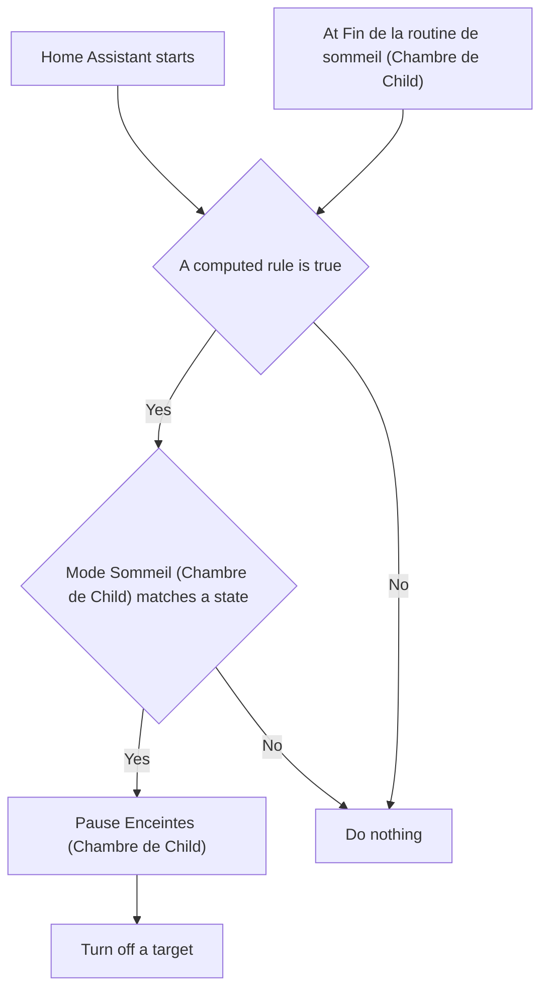
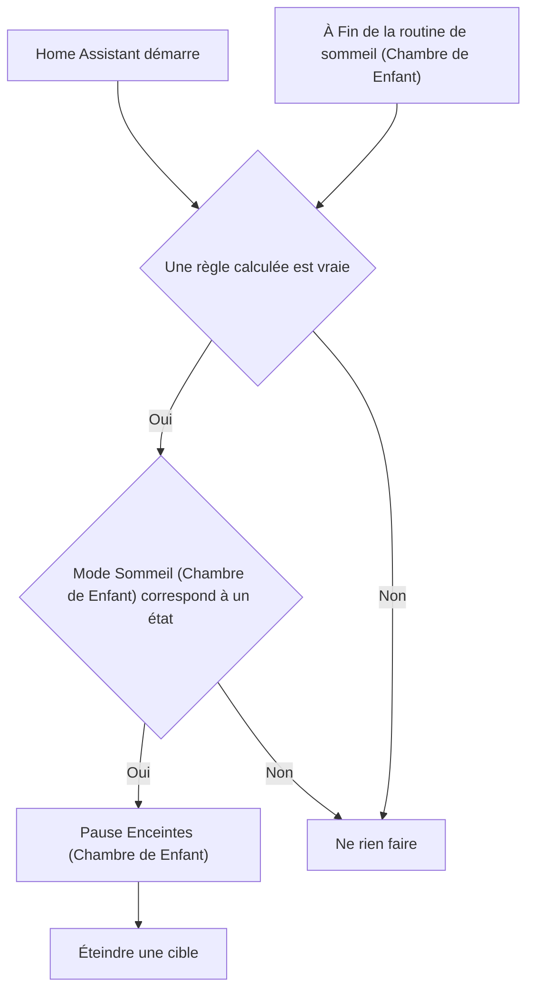

# Routine du sommeil Child - Arrêter / Routine du sommeil Enfant - Arrêter

## English
- Back to guest-friendly view: [child_bedtime_routine](../../../aspects/child_bedtime_routine.md)
- Back to technical aspect index: [child_bedtime_routine](../child_bedtime_routine.md)

### Summary
- Runs when: Home Assistant starts; At Fin de la routine de sommeil (Chambre de Child)
- Only if: A computed rule is true; Mode Sommeil (Chambre de Child) matches a state
- Then: Pause Enceintes (Chambre de Child); Turn off a target

## Français
- Retour vers la vue “invité” : [child_bedtime_routine](../../../aspects/child_bedtime_routine.md)
- Retour vers l’index technique de l’aspect : [child_bedtime_routine](../child_bedtime_routine.md)

### Résumé
- Se déclenche quand : Home Assistant démarre; À Fin de la routine de sommeil (Chambre de Enfant)
- Uniquement si : Une règle calculée est vraie; Mode Sommeil (Chambre de Enfant) correspond à un état
- Ensuite : Pause Enceintes (Chambre de Enfant); Éteindre une cible

