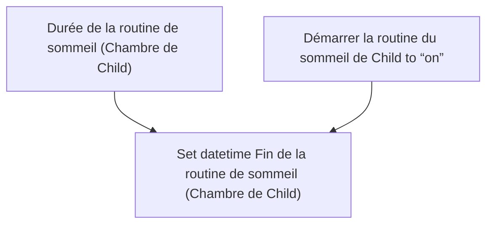
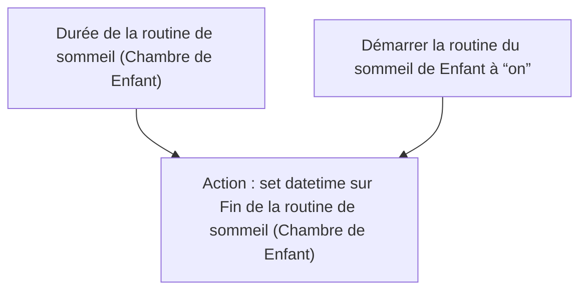

# Routine du sommeil Child - Changer heure fin de routine / Routine du sommeil Enfant - Changer heure fin de routine

## English
- Back to guest-friendly view: [child_bedtime_routine](../../../aspects/child_bedtime_routine.md)
- Back to technical aspect index: [child_bedtime_routine](../child_bedtime_routine.md)

### Summary
- Runs when: Durée de la routine de sommeil (Chambre de Child); Démarrer la routine du sommeil de Child to “on”
- Only if: No extra conditions
- Then: Set datetime Fin de la routine de sommeil (Chambre de Child)

## Français
- Retour vers la vue “invité” : [child_bedtime_routine](../../../aspects/child_bedtime_routine.md)
- Retour vers l’index technique de l’aspect : [child_bedtime_routine](../child_bedtime_routine.md)

### Résumé
- Se déclenche quand : Durée de la routine de sommeil (Chambre de Enfant); Démarrer la routine du sommeil de Enfant à “on”
- Uniquement si : Pas de condition supplémentaire
- Ensuite : Action : set datetime sur Fin de la routine de sommeil (Chambre de Enfant)

