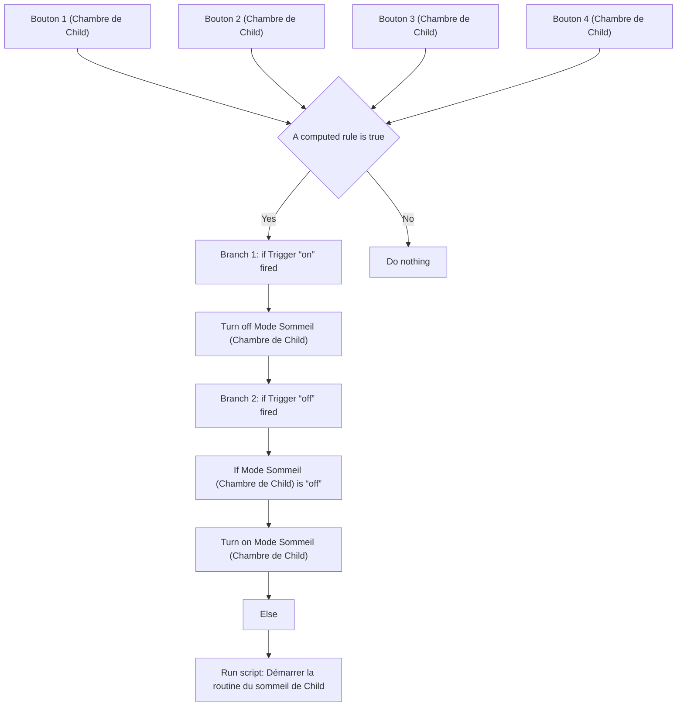
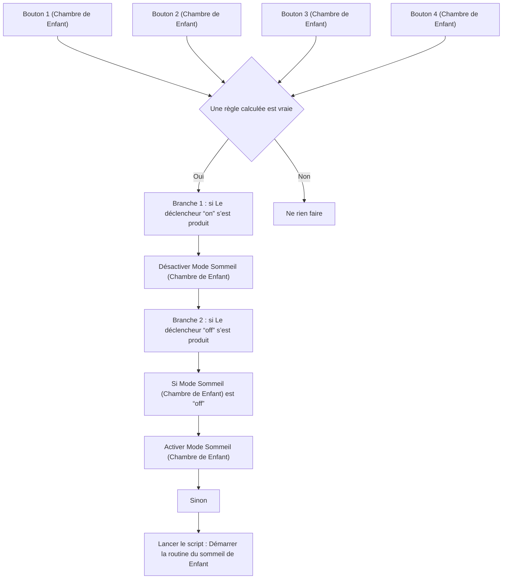

# Mode sommeil Child - Bouton / Mode sommeil Enfant - Bouton

## English
- Back to guest-friendly view: [child_bedtime_routine](../../../aspects/child_bedtime_routine.md)
- Back to technical aspect index: [child_bedtime_routine](../child_bedtime_routine.md)

### Summary
- Runs when: Bouton 1 (Chambre de Child); Bouton 2 (Chambre de Child); Bouton 3 (Chambre de Child); Bouton 4 (Chambre de Child)
- Only if: A computed rule is true
- Then: Branch 1: if Trigger “on” fired; Turn off Mode Sommeil (Chambre de Child); Branch 2: if Trigger “off” fired; If Mode Sommeil (Chambre de Child) is “off”; Turn on Mode Sommeil (Chambre de Child); Else; Run script: Démarrer la routine du sommeil de Child

### Scripts called
- [Démarrer la routine du sommeil de Child](../../scripts/start_child_bedtime_routine.md)

## Français
- Retour vers la vue “invité” : [child_bedtime_routine](../../../aspects/child_bedtime_routine.md)
- Retour vers l’index technique de l’aspect : [child_bedtime_routine](../child_bedtime_routine.md)

### Résumé
- Se déclenche quand : Bouton 1 (Chambre de Enfant); Bouton 2 (Chambre de Enfant); Bouton 3 (Chambre de Enfant); Bouton 4 (Chambre de Enfant)
- Uniquement si : Une règle calculée est vraie
- Ensuite : Branche 1 : si Le déclencheur “on” s’est produit; Désactiver Mode Sommeil (Chambre de Enfant); Branche 2 : si Le déclencheur “off” s’est produit; Si Mode Sommeil (Chambre de Enfant) est “off”; Activer Mode Sommeil (Chambre de Enfant); Sinon; Lancer le script : Démarrer la routine du sommeil de Enfant

### Scripts appelés
- [Démarrer la routine du sommeil de Enfant](../../scripts/start_child_bedtime_routine.md)

