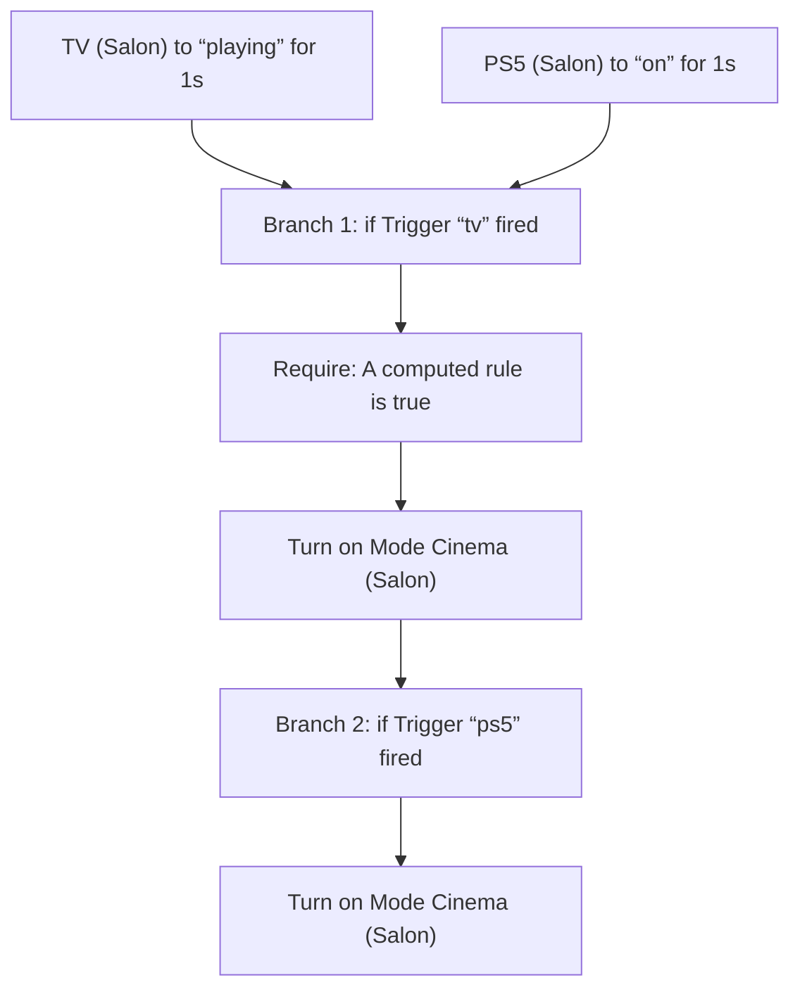
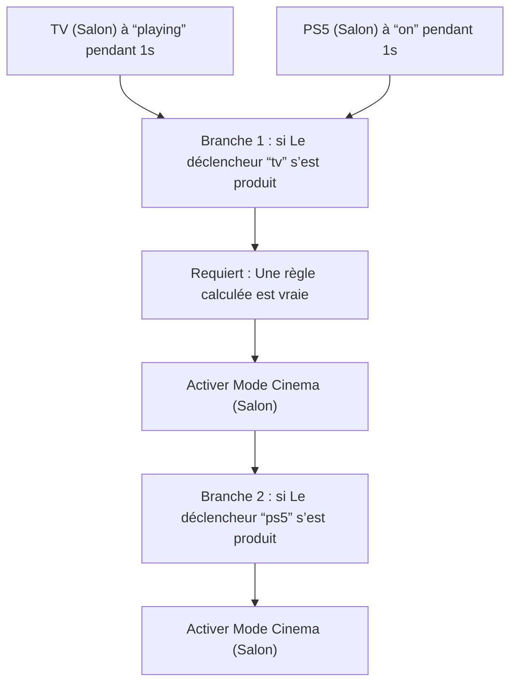

# Mode Cinéma - Activer / Mode Cinéma - Activer

## English
- Back to guest-friendly view: [cinema_mode](../../../aspects/cinema_mode.md)
- Back to technical aspect index: [cinema_mode](../cinema_mode.md)

### Summary
- Runs when: TV (Salon) to “playing” for 1s; PS5 (Salon) to “on” for 1s
- Only if: No extra conditions
- Then: Branch 1: if Trigger “tv” fired; Require: A computed rule is true; Turn on Mode Cinema (Salon); Branch 2: if Trigger “ps5” fired; Turn on Mode Cinema (Salon)

## Français
- Retour vers la vue “invité” : [cinema_mode](../../../aspects/cinema_mode.md)
- Retour vers l’index technique de l’aspect : [cinema_mode](../cinema_mode.md)

### Résumé
- Se déclenche quand : TV (Salon) à “playing” pendant 1s; PS5 (Salon) à “on” pendant 1s
- Uniquement si : Pas de condition supplémentaire
- Ensuite : Branche 1 : si Le déclencheur “tv” s’est produit; Requiert : Une règle calculée est vraie; Activer Mode Cinema (Salon); Branche 2 : si Le déclencheur “ps5” s’est produit; Activer Mode Cinema (Salon)

