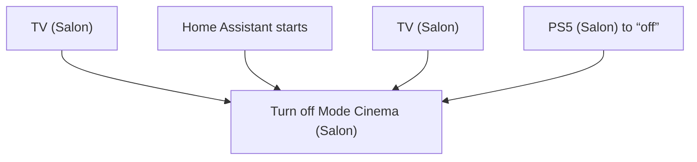
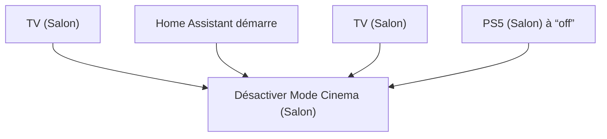

# Mode Cinéma - Désactiver / Mode Cinéma - Désactiver

## English
- Back to guest-friendly view: [cinema_mode](../../../aspects/cinema_mode.md)
- Back to technical aspect index: [cinema_mode](../cinema_mode.md)

### Summary
- Runs when: TV (Salon); Home Assistant starts; TV (Salon); PS5 (Salon) to “off”
- Only if: No extra conditions
- Then: Turn off Mode Cinema (Salon)

## Français
- Retour vers la vue “invité” : [cinema_mode](../../../aspects/cinema_mode.md)
- Retour vers l’index technique de l’aspect : [cinema_mode](../cinema_mode.md)

### Résumé
- Se déclenche quand : TV (Salon); Home Assistant démarre; TV (Salon); PS5 (Salon) à “off”
- Uniquement si : Pas de condition supplémentaire
- Ensuite : Désactiver Mode Cinema (Salon)

