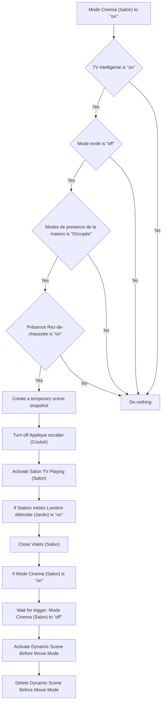
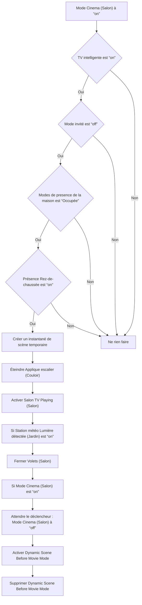

# Mode Cinéma - Controller Lumières et Volets / Mode Cinéma - Controller Lumières et Volets

## English
- Back to guest-friendly view: [cinema_mode](../../../aspects/cinema_mode.md)
- Back to technical aspect index: [cinema_mode](../cinema_mode.md)

### Summary
- Runs when: Mode Cinema (Salon) to “on”
- Only if: TV intelligente is “on”; Mode invité is “off”; Modes de presence de la maison is “Occupée”; Présence Rez-de-chaussée is “on”
- Then: Create a temporary scene snapshot; Turn off Applique escalier (Couloir); Activate Salon TV Playing (Salon); If Station météo Lumière détectée (Jardin) is “on”; Close Volets (Salon); If Mode Cinema (Salon) is “on”; Wait for trigger: Mode Cinema (Salon) to “off”; Activate Dynamic Scene Before Movie Mode; Delete Dynamic Scene Before Movie Mode

## Français
- Retour vers la vue “invité” : [cinema_mode](../../../aspects/cinema_mode.md)
- Retour vers l’index technique de l’aspect : [cinema_mode](../cinema_mode.md)

### Résumé
- Se déclenche quand : Mode Cinema (Salon) à “on”
- Uniquement si : TV intelligente est “on”; Mode invité est “off”; Modes de presence de la maison est “Occupée”; Présence Rez-de-chaussée est “on”
- Ensuite : Créer un instantané de scène temporaire; Éteindre Applique escalier (Couloir); Activer Salon TV Playing (Salon); Si Station météo Lumière détectée (Jardin) est “on”; Fermer Volets (Salon); Si Mode Cinema (Salon) est “on”; Attendre le déclencheur : Mode Cinema (Salon) à “off”; Activer Dynamic Scene Before Movie Mode; Supprimer Dynamic Scene Before Movie Mode

