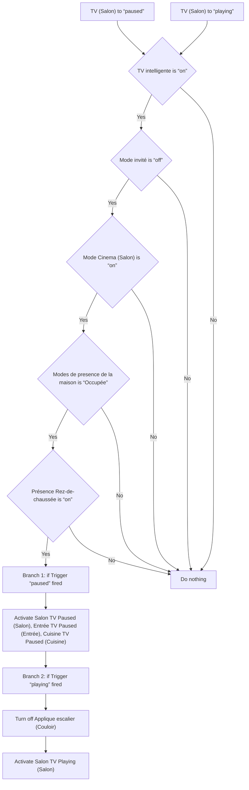
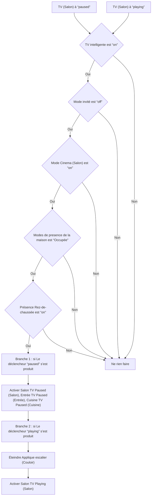

# Mode Cinéma - Play / Pause / Mode Cinéma - Play / Pause

## English
- Back to guest-friendly view: [cinema_mode](../../../aspects/cinema_mode.md)
- Back to technical aspect index: [cinema_mode](../cinema_mode.md)

### Summary
- Runs when: TV (Salon) to “paused”; TV (Salon) to “playing”
- Only if: TV intelligente is “on”; Mode invité is “off”; Mode Cinema (Salon) is “on”; Modes de presence de la maison is “Occupée”; Présence Rez-de-chaussée is “on”
- Then: Branch 1: if Trigger “paused” fired; Activate Salon TV Paused (Salon), Entrée TV Paused (Entrée), Cuisine TV Paused (Cuisine); Branch 2: if Trigger “playing” fired; Turn off Applique escalier (Couloir); Activate Salon TV Playing (Salon)

## Français
- Retour vers la vue “invité” : [cinema_mode](../../../aspects/cinema_mode.md)
- Retour vers l’index technique de l’aspect : [cinema_mode](../cinema_mode.md)

### Résumé
- Se déclenche quand : TV (Salon) à “paused”; TV (Salon) à “playing”
- Uniquement si : TV intelligente est “on”; Mode invité est “off”; Mode Cinema (Salon) est “on”; Modes de presence de la maison est “Occupée”; Présence Rez-de-chaussée est “on”
- Ensuite : Branche 1 : si Le déclencheur “paused” s’est produit; Activer Salon TV Paused (Salon), Entrée TV Paused (Entrée), Cuisine TV Paused (Cuisine); Branche 2 : si Le déclencheur “playing” s’est produit; Éteindre Applique escalier (Couloir); Activer Salon TV Playing (Salon)

