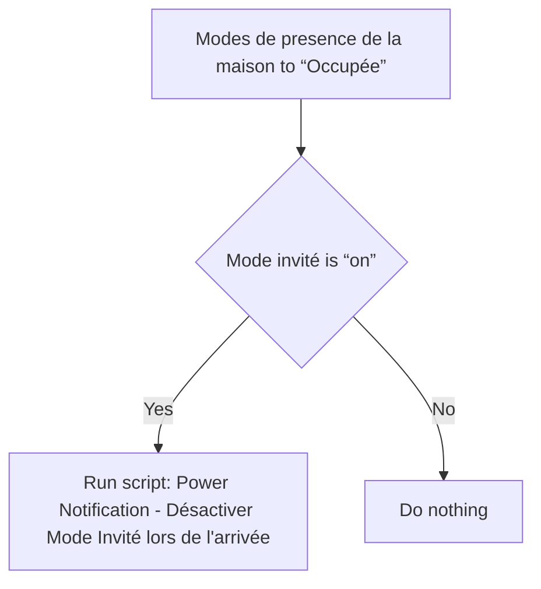
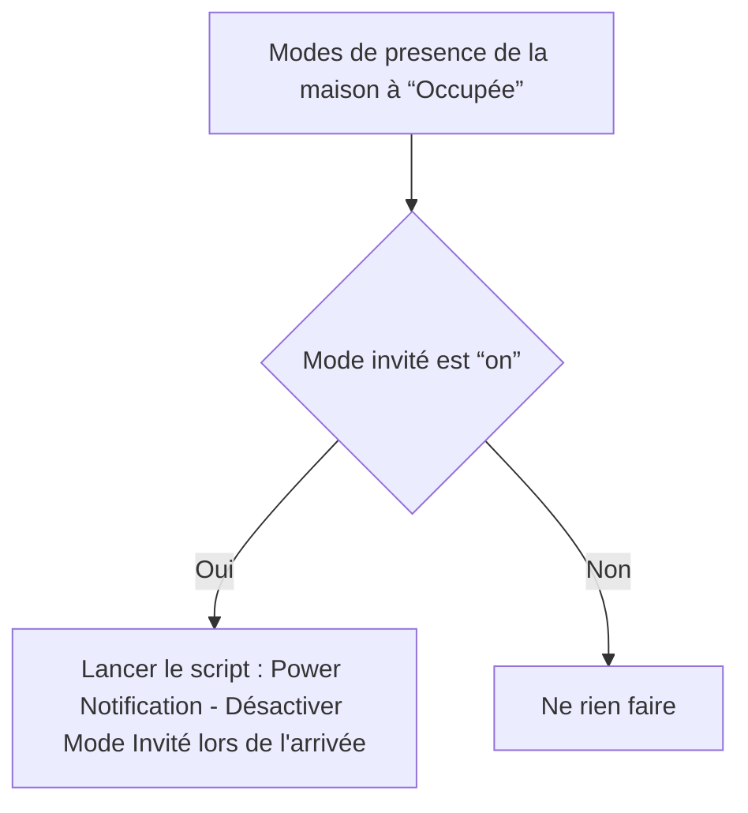

# Mode Invité - 🔔 Notifier mode invité lors de l'arrivée / Mode Invité - 🔔 Notifier mode invité lors de l'arrivée

## English
- Back to guest-friendly view: [guest_mode](../../../aspects/guest_mode.md)
- Back to technical aspect index: [guest_mode](../guest_mode.md)

### Summary
- Runs when: Modes de presence de la maison to “Occupée”
- Only if: Mode invité is “on”
- Then: Run script: Power Notification - Désactiver Mode Invité lors de l'arrivée

### Scripts called
- [Power Notification - Désactiver Mode Invité lors de l'arrivée](../../scripts/power_notification_desactiver_mode_invite_lors_de_l_arrivee.md)

## Français
- Retour vers la vue “invité” : [guest_mode](../../../aspects/guest_mode.md)
- Retour vers l’index technique de l’aspect : [guest_mode](../guest_mode.md)

### Résumé
- Se déclenche quand : Modes de presence de la maison à “Occupée”
- Uniquement si : Mode invité est “on”
- Ensuite : Lancer le script : Power Notification - Désactiver Mode Invité lors de l'arrivée

### Scripts appelés
- [Power Notification - Désactiver Mode Invité lors de l'arrivée](../../scripts/power_notification_desactiver_mode_invite_lors_de_l_arrivee.md)

