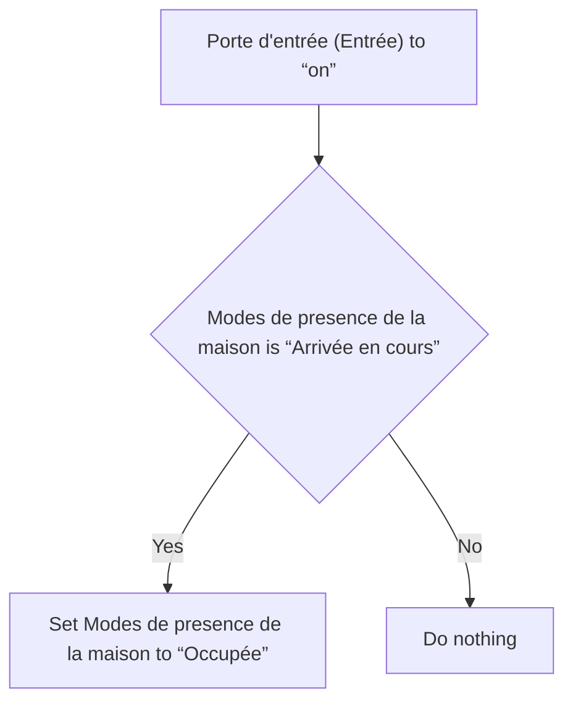
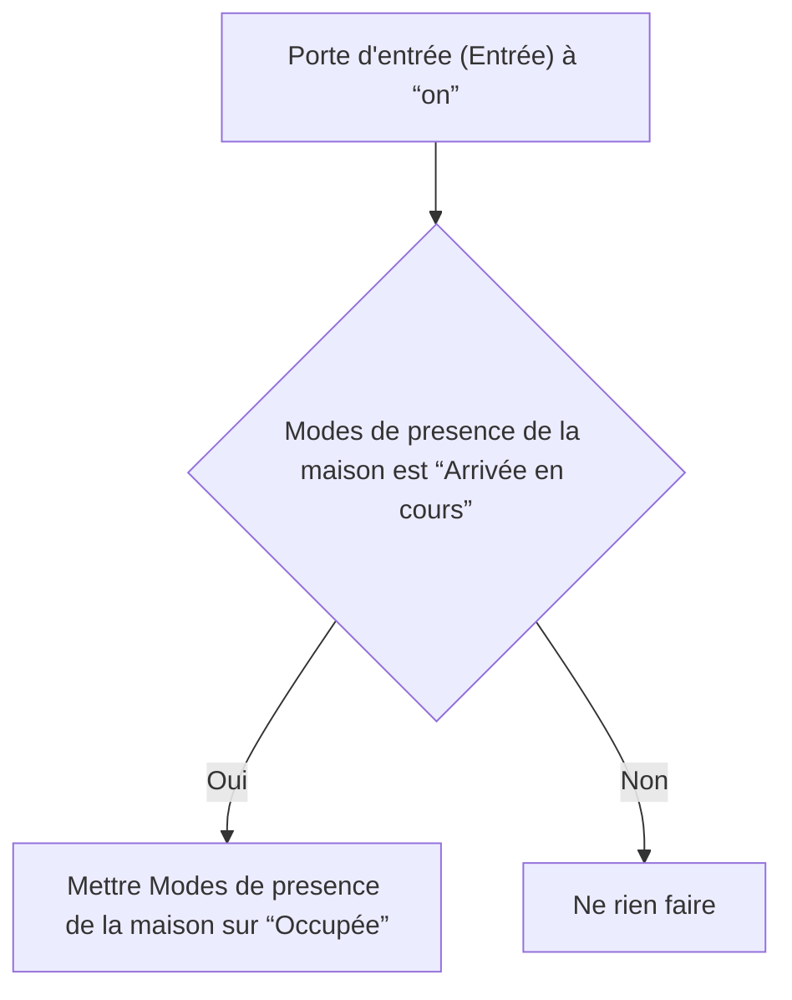

# Modes de presence de la maison - Occupée lors de l'ouverture de la porte / Modes de presence de la maison - Occupée lors de l'ouverture de la porte

## English
- Back to guest-friendly view: [home_presence_modes](../../../aspects/home_presence_modes.md)
- Back to technical aspect index: [home_presence_modes](../home_presence_modes.md)

### Summary
- Runs when: Porte d'entrée (Entrée) to “on”
- Only if: Modes de presence de la maison is “Arrivée en cours”
- Then: Set Modes de presence de la maison to “Occupée”

## Français
- Retour vers la vue “invité” : [home_presence_modes](../../../aspects/home_presence_modes.md)
- Retour vers l’index technique de l’aspect : [home_presence_modes](../home_presence_modes.md)

### Résumé
- Se déclenche quand : Porte d'entrée (Entrée) à “on”
- Uniquement si : Modes de presence de la maison est “Arrivée en cours”
- Ensuite : Mettre Modes de presence de la maison sur “Occupée”

