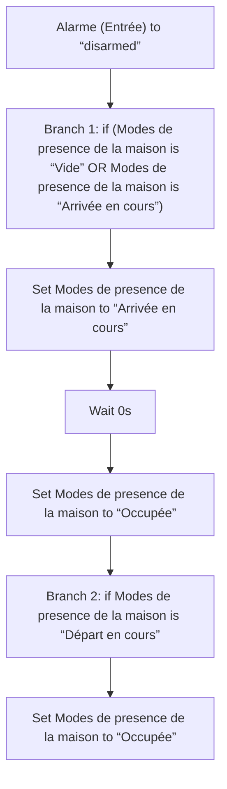
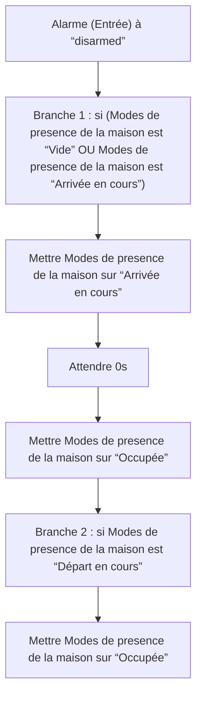

# Modes de presence de la maison - Occupée via Alarme / Modes de presence de la maison - Occupée via Alarme

## English
- Back to guest-friendly view: [home_presence_modes](../../../aspects/home_presence_modes.md)
- Back to technical aspect index: [home_presence_modes](../home_presence_modes.md)

### Summary
- Runs when: Alarme (Entrée) to “disarmed”
- Only if: No extra conditions
- Then: Branch 1: if (Modes de presence de la maison is “Vide” OR Modes de presence de la maison is “Arrivée en cours”); Set Modes de presence de la maison to “Arrivée en cours”; Wait 0s; Set Modes de presence de la maison to “Occupée”; Branch 2: if Modes de presence de la maison is “Départ en cours”; Set Modes de presence de la maison to “Occupée”

## Français
- Retour vers la vue “invité” : [home_presence_modes](../../../aspects/home_presence_modes.md)
- Retour vers l’index technique de l’aspect : [home_presence_modes](../home_presence_modes.md)

### Résumé
- Se déclenche quand : Alarme (Entrée) à “disarmed”
- Uniquement si : Pas de condition supplémentaire
- Ensuite : Branche 1 : si (Modes de presence de la maison est “Vide” OU Modes de presence de la maison est “Arrivée en cours”); Mettre Modes de presence de la maison sur “Arrivée en cours”; Attendre 0s; Mettre Modes de presence de la maison sur “Occupée”; Branche 2 : si Modes de presence de la maison est “Départ en cours”; Mettre Modes de presence de la maison sur “Occupée”

