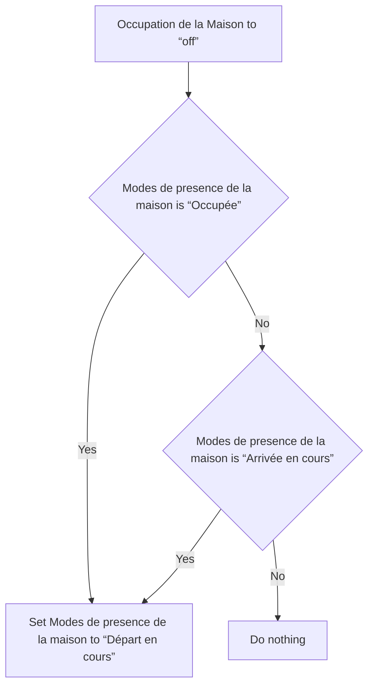
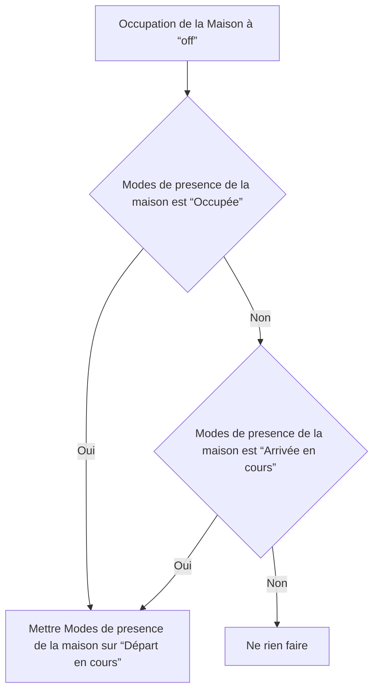

# Modes de presence de la maison - Départ en cours via Occupation de la maison / Modes de presence de la maison - Départ en cours via Occupation de la maison

## English
- Back to guest-friendly view: [home_presence_modes](../../../aspects/home_presence_modes.md)
- Back to technical aspect index: [home_presence_modes](../home_presence_modes.md)

### Summary
- Runs when: Occupation de la Maison to “off”
- Only if: (Modes de presence de la maison is “Occupée” OR Modes de presence de la maison is “Arrivée en cours”)
- Then: Set Modes de presence de la maison to “Départ en cours”

## Français
- Retour vers la vue “invité” : [home_presence_modes](../../../aspects/home_presence_modes.md)
- Retour vers l’index technique de l’aspect : [home_presence_modes](../home_presence_modes.md)

### Résumé
- Se déclenche quand : Occupation de la Maison à “off”
- Uniquement si : (Modes de presence de la maison est “Occupée” OU Modes de presence de la maison est “Arrivée en cours”)
- Ensuite : Mettre Modes de presence de la maison sur “Départ en cours”

