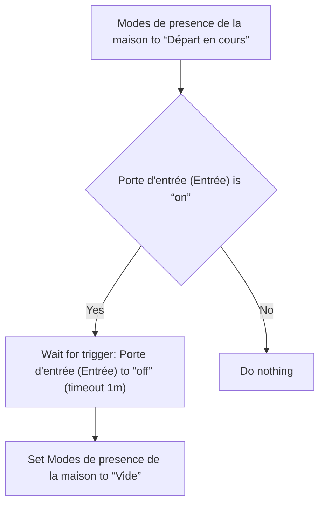
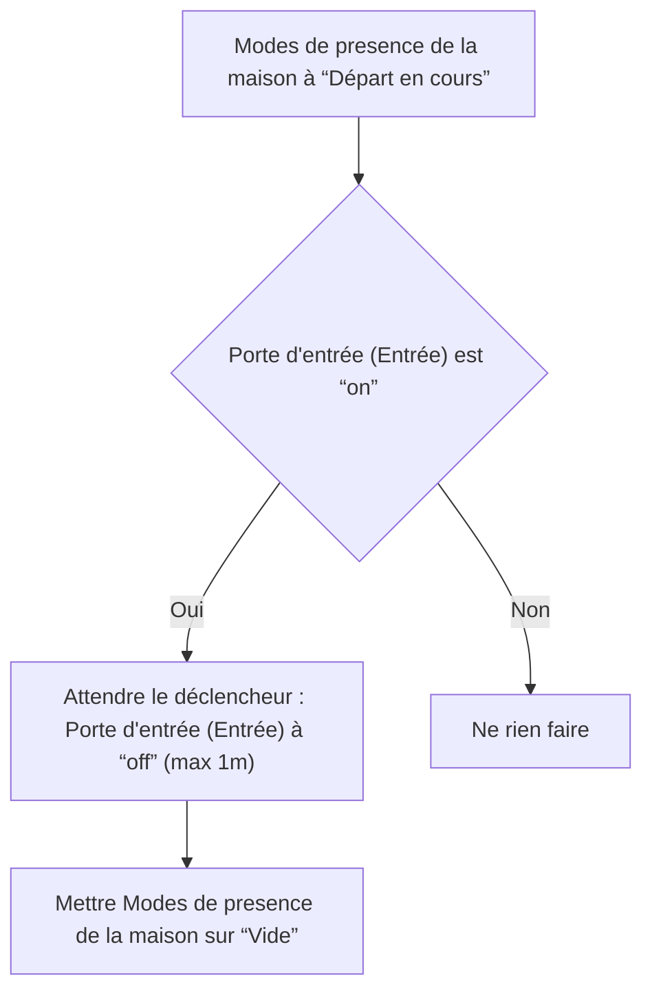

# Modes de presence de la maison - Vide si porte déjà ouverte lors du départ / Modes de presence de la maison - Vide si porte déjà ouverte lors du départ

## English
- Back to guest-friendly view: [home_presence_modes](../../../aspects/home_presence_modes.md)
- Back to technical aspect index: [home_presence_modes](../home_presence_modes.md)

### Summary
- Runs when: Modes de presence de la maison to “Départ en cours”
- Only if: Porte d'entrée (Entrée) is “on”
- Then: Wait for trigger: Porte d'entrée (Entrée) to “off” (timeout 1m); Set Modes de presence de la maison to “Vide”

## Français
- Retour vers la vue “invité” : [home_presence_modes](../../../aspects/home_presence_modes.md)
- Retour vers l’index technique de l’aspect : [home_presence_modes](../home_presence_modes.md)

### Résumé
- Se déclenche quand : Modes de presence de la maison à “Départ en cours”
- Uniquement si : Porte d'entrée (Entrée) est “on”
- Ensuite : Attendre le déclencheur : Porte d'entrée (Entrée) à “off” (max 1m); Mettre Modes de presence de la maison sur “Vide”

