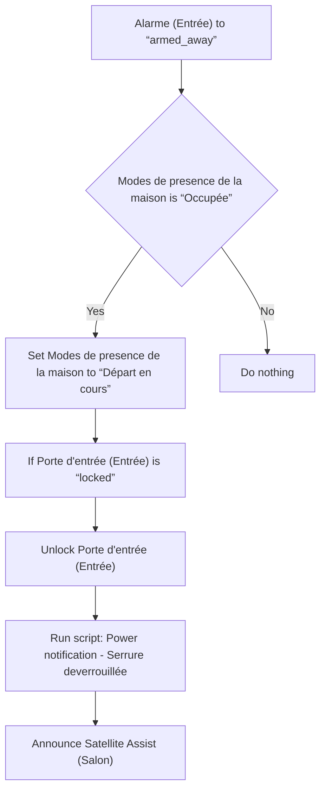
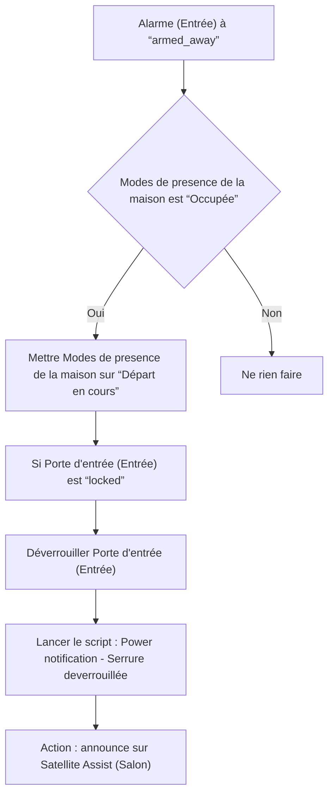

# Modes de presence de la maison - Départ en cours via Alarme / Modes de presence de la maison - Départ en cours via Alarme

## English
- Back to guest-friendly view: [home_presence_modes](../../../aspects/home_presence_modes.md)
- Back to technical aspect index: [home_presence_modes](../home_presence_modes.md)

### Summary
- Runs when: Alarme (Entrée) to “armed_away”
- Only if: Modes de presence de la maison is “Occupée”
- Then: Set Modes de presence de la maison to “Départ en cours”; If Porte d'entrée (Entrée) is “locked”; Unlock Porte d'entrée (Entrée); Run script: Power notification - Serrure deverrouillée; Announce Satellite Assist (Salon)

### Scripts called
- [Power notification - Serrure deverrouillée](../../scripts/power_notification_serrure_deverrouillee.md)

## Français
- Retour vers la vue “invité” : [home_presence_modes](../../../aspects/home_presence_modes.md)
- Retour vers l’index technique de l’aspect : [home_presence_modes](../home_presence_modes.md)

### Résumé
- Se déclenche quand : Alarme (Entrée) à “armed_away”
- Uniquement si : Modes de presence de la maison est “Occupée”
- Ensuite : Mettre Modes de presence de la maison sur “Départ en cours”; Si Porte d'entrée (Entrée) est “locked”; Déverrouiller Porte d'entrée (Entrée); Lancer le script : Power notification - Serrure deverrouillée; Action : announce sur Satellite Assist (Salon)

### Scripts appelés
- [Power notification - Serrure deverrouillée](../../scripts/power_notification_serrure_deverrouillee.md)

