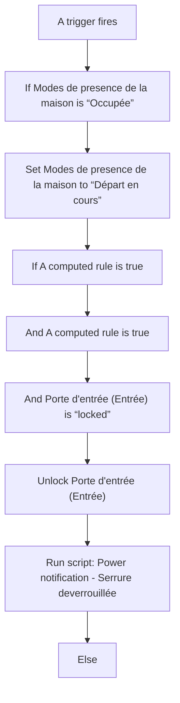
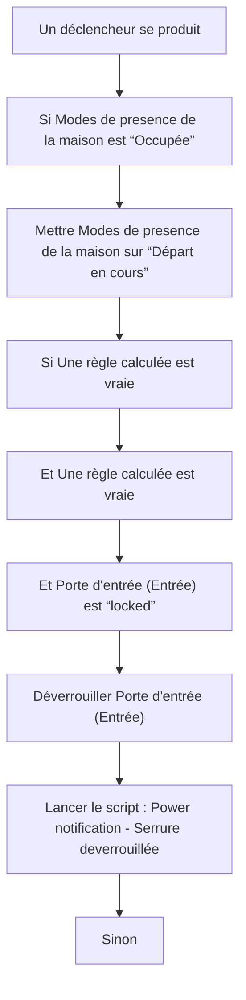

# Modes de presence de la maison - Départ en cours via la voix / Modes de presence de la maison - Départ en cours via la voix

## English
- Back to guest-friendly view: [home_presence_modes](../../../aspects/home_presence_modes.md)
- Back to technical aspect index: [home_presence_modes](../home_presence_modes.md)

### Summary
- Runs when: A trigger fires
- Only if: No extra conditions
- Then: If Modes de presence de la maison is “Occupée”; Set Modes de presence de la maison to “Départ en cours”; If A computed rule is true; And A computed rule is true; And Porte d'entrée (Entrée) is “locked”; Unlock Porte d'entrée (Entrée); Run script: Power notification - Serrure deverrouillée; Else

### Scripts called
- [Power notification - Serrure deverrouillée](../../scripts/power_notification_serrure_deverrouillee.md)

## Français
- Retour vers la vue “invité” : [home_presence_modes](../../../aspects/home_presence_modes.md)
- Retour vers l’index technique de l’aspect : [home_presence_modes](../home_presence_modes.md)

### Résumé
- Se déclenche quand : Un déclencheur se produit
- Uniquement si : Pas de condition supplémentaire
- Ensuite : Si Modes de presence de la maison est “Occupée”; Mettre Modes de presence de la maison sur “Départ en cours”; Si Une règle calculée est vraie; Et Une règle calculée est vraie; Et Porte d'entrée (Entrée) est “locked”; Déverrouiller Porte d'entrée (Entrée); Lancer le script : Power notification - Serrure deverrouillée; Sinon

### Scripts appelés
- [Power notification - Serrure deverrouillée](../../scripts/power_notification_serrure_deverrouillee.md)

