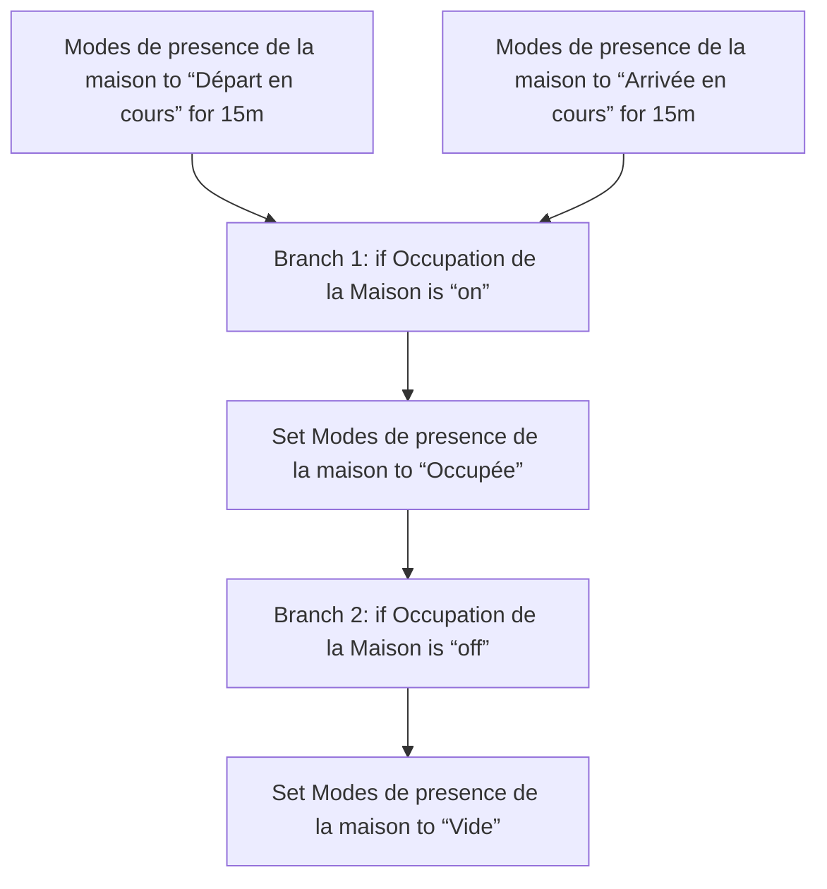
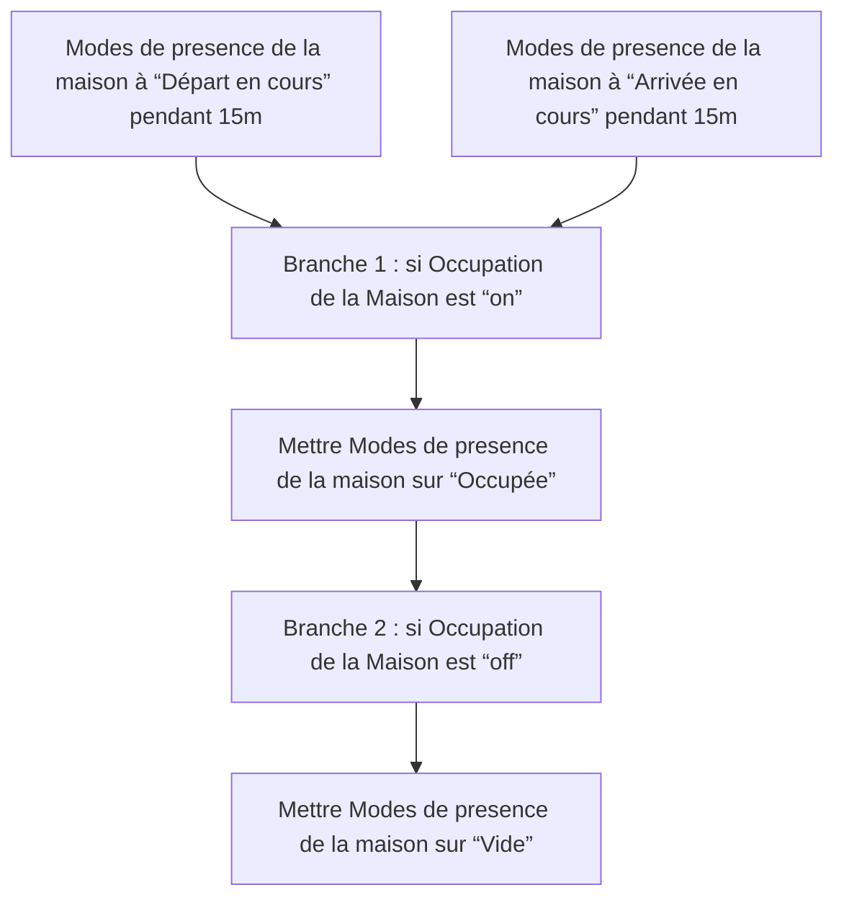

# Modes de presence de la maison / Fallback modes temporaires / Modes de presence de la maison / Fallback modes temporaires

## English
- Back to guest-friendly view: [home_presence_modes](../../../aspects/home_presence_modes.md)
- Back to technical aspect index: [home_presence_modes](../home_presence_modes.md)

### Summary
- Runs when: Modes de presence de la maison to “Départ en cours” for 15m; Modes de presence de la maison to “Arrivée en cours” for 15m
- Only if: No extra conditions
- Then: Branch 1: if Occupation de la Maison is “on”; Set Modes de presence de la maison to “Occupée”; Branch 2: if Occupation de la Maison is “off”; Set Modes de presence de la maison to “Vide”

## Français
- Retour vers la vue “invité” : [home_presence_modes](../../../aspects/home_presence_modes.md)
- Retour vers l’index technique de l’aspect : [home_presence_modes](../home_presence_modes.md)

### Résumé
- Se déclenche quand : Modes de presence de la maison à “Départ en cours” pendant 15m; Modes de presence de la maison à “Arrivée en cours” pendant 15m
- Uniquement si : Pas de condition supplémentaire
- Ensuite : Branche 1 : si Occupation de la Maison est “on”; Mettre Modes de presence de la maison sur “Occupée”; Branche 2 : si Occupation de la Maison est “off”; Mettre Modes de presence de la maison sur “Vide”

