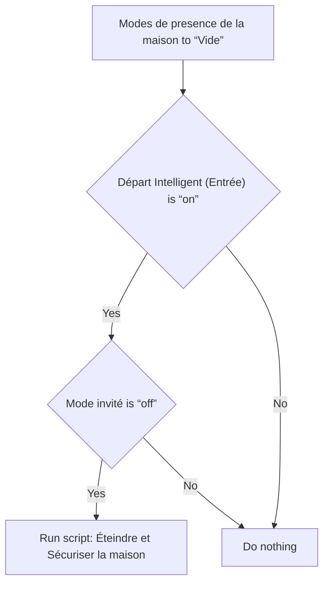
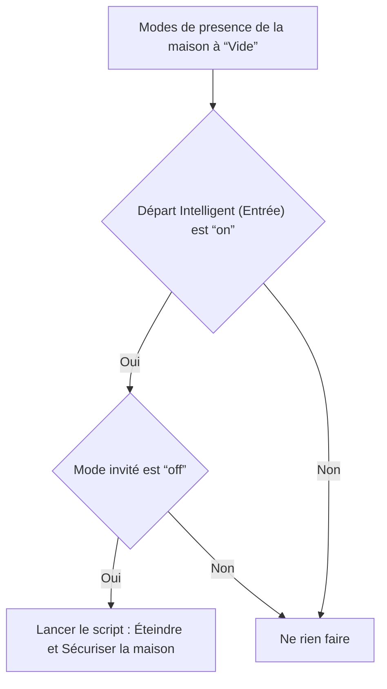

# Surveillance de la maison - Éteindre appareils lors du départ / Surveillance de la maison - Éteindre appareils lors du départ

## English
- Back to guest-friendly view: [home_security_and_safety](../../../aspects/home_security_and_safety.md)
- Back to technical aspect index: [home_security_and_safety](../home_security_and_safety.md)

### Summary
- Runs when: Modes de presence de la maison to “Vide”
- Only if: Départ Intelligent (Entrée) is “on”; Mode invité is “off”
- Then: Run script: Éteindre et Sécuriser la maison

### Scripts called
- [Éteindre et Sécuriser la maison](../../scripts/leave_home.md)

## Français
- Retour vers la vue “invité” : [home_security_and_safety](../../../aspects/home_security_and_safety.md)
- Retour vers l’index technique de l’aspect : [home_security_and_safety](../home_security_and_safety.md)

### Résumé
- Se déclenche quand : Modes de presence de la maison à “Vide”
- Uniquement si : Départ Intelligent (Entrée) est “on”; Mode invité est “off”
- Ensuite : Lancer le script : Éteindre et Sécuriser la maison

### Scripts appelés
- [Éteindre et Sécuriser la maison](../../scripts/leave_home.md)

