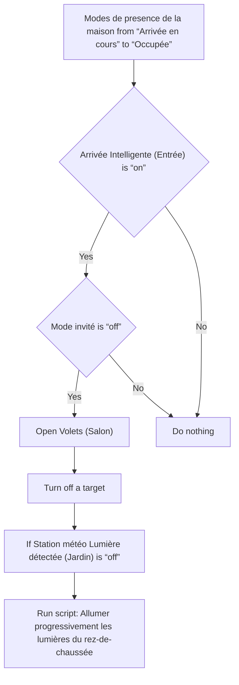
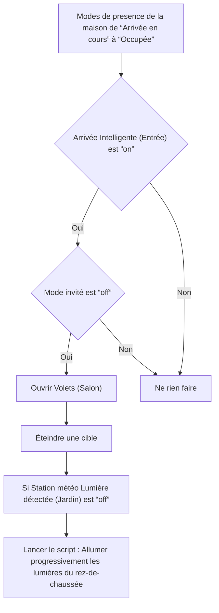

# Surveillance de la maison - Allumer appareils lors de l'arrivée / Surveillance de la maison - Allumer appareils lors de l'arrivée

## English
- Back to guest-friendly view: [home_security_and_safety](../../../aspects/home_security_and_safety.md)
- Back to technical aspect index: [home_security_and_safety](../home_security_and_safety.md)

### Summary
- Runs when: Modes de presence de la maison from “Arrivée en cours” to “Occupée”
- Only if: Arrivée Intelligente (Entrée) is “on”; Mode invité is “off”
- Then: Open Volets (Salon); Turn off a target; If Station météo Lumière détectée (Jardin) is “off”; Run script: Allumer progressivement les lumières du rez-de-chaussée

### Scripts called
- [Allumer progressivement les lumières du rez-de-chaussée](../../scripts/welcome_home.md)

## Français
- Retour vers la vue “invité” : [home_security_and_safety](../../../aspects/home_security_and_safety.md)
- Retour vers l’index technique de l’aspect : [home_security_and_safety](../home_security_and_safety.md)

### Résumé
- Se déclenche quand : Modes de presence de la maison de “Arrivée en cours” à “Occupée”
- Uniquement si : Arrivée Intelligente (Entrée) est “on”; Mode invité est “off”
- Ensuite : Ouvrir Volets (Salon); Éteindre une cible; Si Station météo Lumière détectée (Jardin) est “off”; Lancer le script : Allumer progressivement les lumières du rez-de-chaussée

### Scripts appelés
- [Allumer progressivement les lumières du rez-de-chaussée](../../scripts/welcome_home.md)

