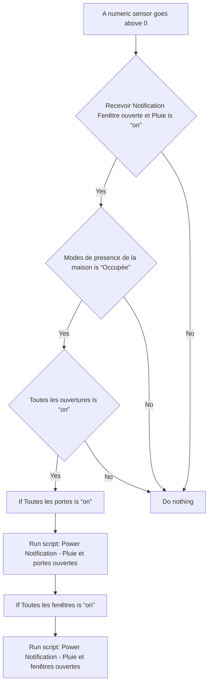
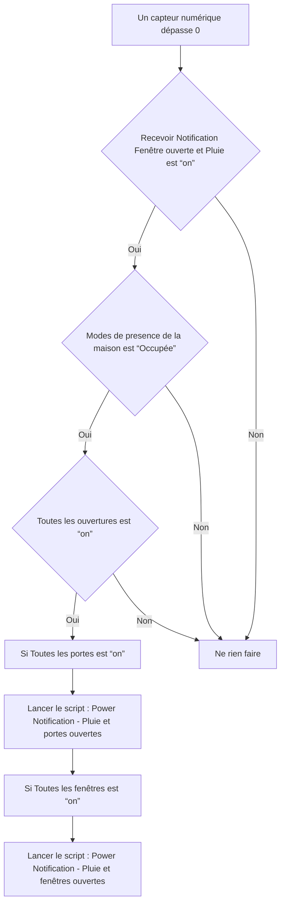

# Surveillance de la maison - 🔔 Notifier pluie et portes/fenêtres ouvertes / Surveillance de la maison - 🔔 Notifier pluie et portes/fenêtres ouvertes

## English
- Back to guest-friendly view: [home_security_and_safety](../../../aspects/home_security_and_safety.md)
- Back to technical aspect index: [home_security_and_safety](../home_security_and_safety.md)

### Summary
- Runs when: A numeric sensor goes above 0
- Only if: Recevoir Notification Fenêtre ouverte et Pluie is “on”; Modes de presence de la maison is “Occupée”; Toutes les ouvertures is “on”
- Then: If Toutes les portes is “on”; Run script: Power Notification - Pluie et portes ouvertes; If Toutes les fenêtres is “on”; Run script: Power Notification - Pluie et fenêtres ouvertes

### Scripts called
- [Power Notification - Pluie et fenêtres ouvertes](../../scripts/power_notification_pluie_et_fenetres_ouvertes.md)
- [Power Notification - Pluie et portes ouvertes](../../scripts/power_notification_pluie_et_portes_ouvertes.md)

## Français
- Retour vers la vue “invité” : [home_security_and_safety](../../../aspects/home_security_and_safety.md)
- Retour vers l’index technique de l’aspect : [home_security_and_safety](../home_security_and_safety.md)

### Résumé
- Se déclenche quand : Un capteur numérique dépasse 0
- Uniquement si : Recevoir Notification Fenêtre ouverte et Pluie est “on”; Modes de presence de la maison est “Occupée”; Toutes les ouvertures est “on”
- Ensuite : Si Toutes les portes est “on”; Lancer le script : Power Notification - Pluie et portes ouvertes; Si Toutes les fenêtres est “on”; Lancer le script : Power Notification - Pluie et fenêtres ouvertes

### Scripts appelés
- [Power Notification - Pluie et fenêtres ouvertes](../../scripts/power_notification_pluie_et_fenetres_ouvertes.md)
- [Power Notification - Pluie et portes ouvertes](../../scripts/power_notification_pluie_et_portes_ouvertes.md)

