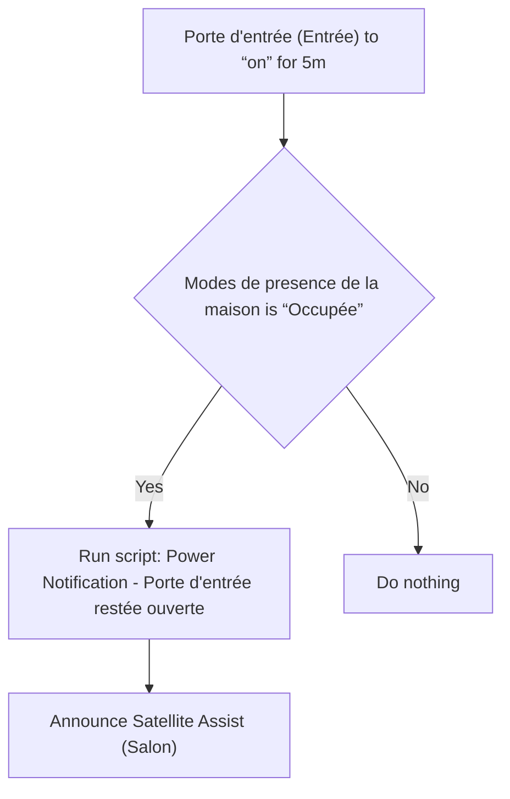
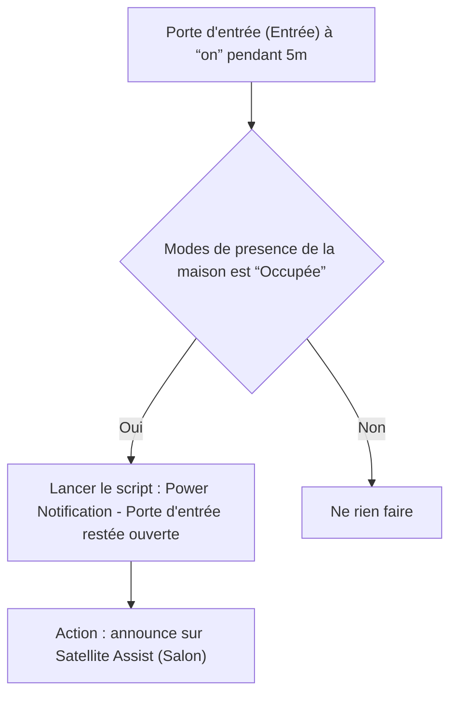

# 🔔 Notifier porte d'entrée ouverte / 🔔 Notifier porte d'entrée ouverte

## English
- Back to guest-friendly view: [home_security_and_safety](../../../aspects/home_security_and_safety.md)
- Back to technical aspect index: [home_security_and_safety](../home_security_and_safety.md)

### Summary
- Runs when: Porte d'entrée (Entrée) to “on” for 5m
- Only if: Modes de presence de la maison is “Occupée”
- Then: Run script: Power Notification - Porte d'entrée restée ouverte; Announce Satellite Assist (Salon)

### Scripts called
- [Power Notification - Porte d'entrée restée ouverte](../../scripts/power_notification_porte_d_entree_restee_ouverte.md)

## Français
- Retour vers la vue “invité” : [home_security_and_safety](../../../aspects/home_security_and_safety.md)
- Retour vers l’index technique de l’aspect : [home_security_and_safety](../home_security_and_safety.md)

### Résumé
- Se déclenche quand : Porte d'entrée (Entrée) à “on” pendant 5m
- Uniquement si : Modes de presence de la maison est “Occupée”
- Ensuite : Lancer le script : Power Notification - Porte d'entrée restée ouverte; Action : announce sur Satellite Assist (Salon)

### Scripts appelés
- [Power Notification - Porte d'entrée restée ouverte](../../scripts/power_notification_porte_d_entree_restee_ouverte.md)

