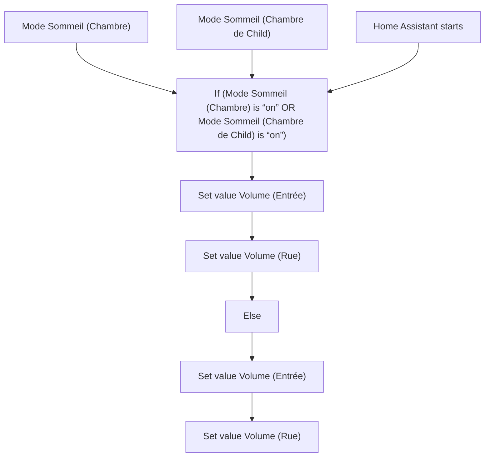
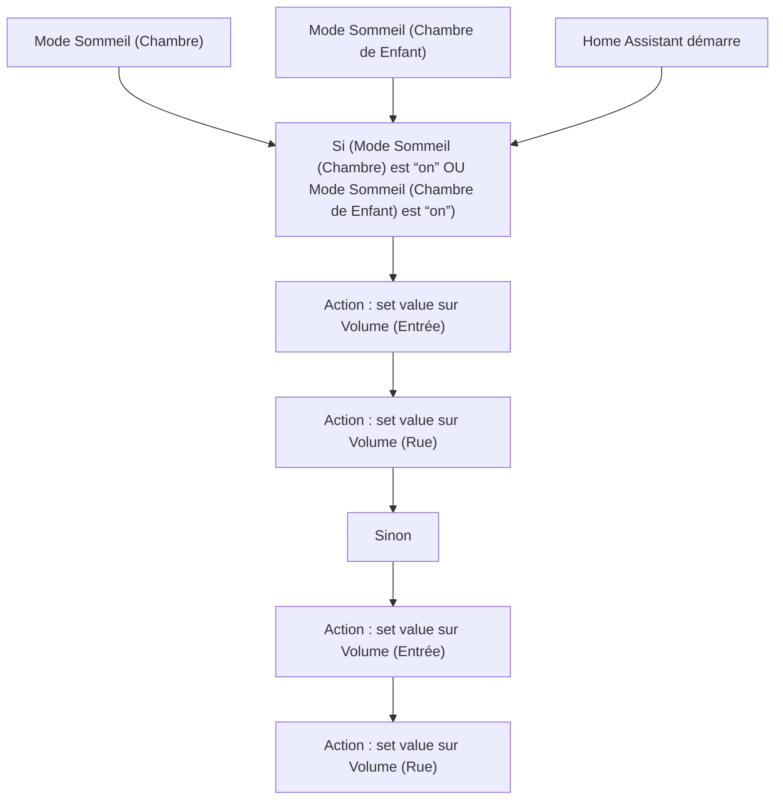

# Sonnette vidéo - Contrôler le volume avec les modes sommeil / Sonnette vidéo - Contrôler le volume avec les modes sommeil

## English
- Back to guest-friendly view: [home_security_and_safety](../../../aspects/home_security_and_safety.md)
- Back to technical aspect index: [home_security_and_safety](../home_security_and_safety.md)

### Summary
- Runs when: Mode Sommeil (Chambre); Mode Sommeil (Chambre de Child); Home Assistant starts
- Only if: No extra conditions
- Then: If (Mode Sommeil (Chambre) is “on” OR Mode Sommeil (Chambre de Child) is “on”); Set value Volume (Entrée); Set value Volume (Rue); Else; Set value Volume (Entrée); Set value Volume (Rue)

## Français
- Retour vers la vue “invité” : [home_security_and_safety](../../../aspects/home_security_and_safety.md)
- Retour vers l’index technique de l’aspect : [home_security_and_safety](../home_security_and_safety.md)

### Résumé
- Se déclenche quand : Mode Sommeil (Chambre); Mode Sommeil (Chambre de Enfant); Home Assistant démarre
- Uniquement si : Pas de condition supplémentaire
- Ensuite : Si (Mode Sommeil (Chambre) est “on” OU Mode Sommeil (Chambre de Enfant) est “on”); Action : set value sur Volume (Entrée); Action : set value sur Volume (Rue); Sinon; Action : set value sur Volume (Entrée); Action : set value sur Volume (Rue)

