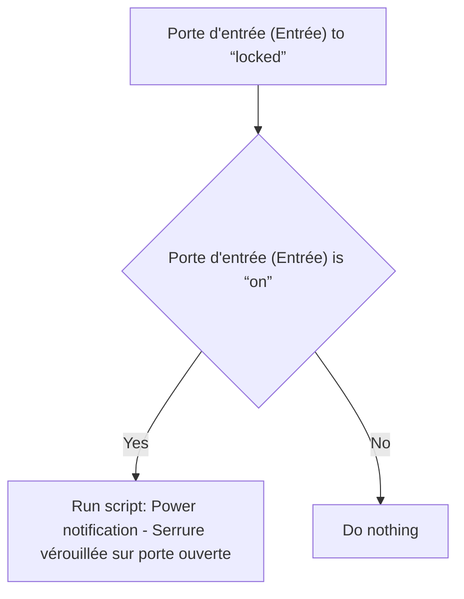
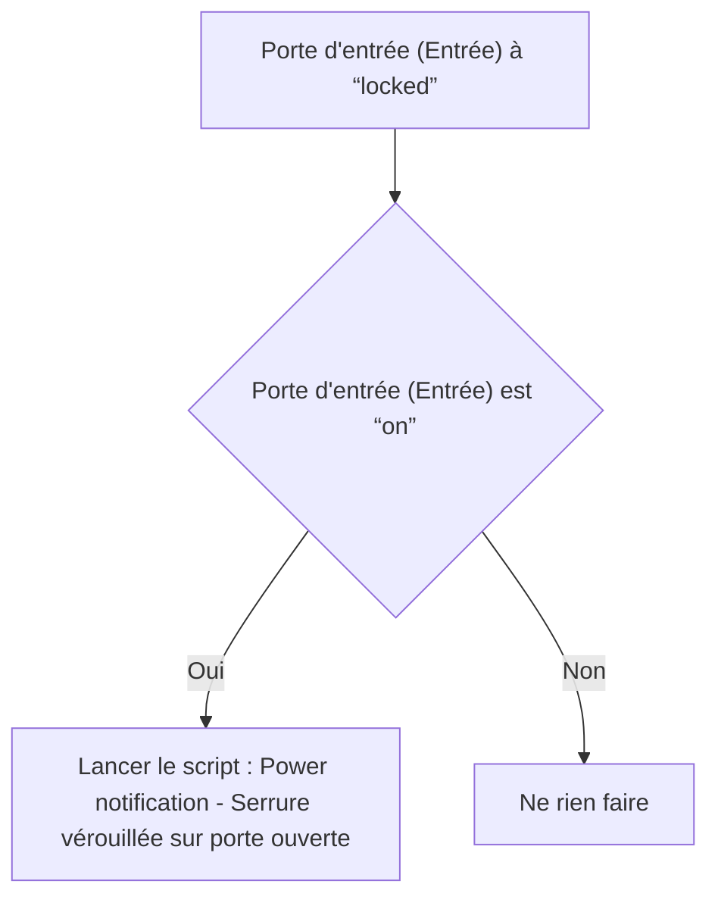

# Serrure - Notifier si porte ouverte et serrure vérouillée / Serrure - Notifier si porte ouverte et serrure vérouillée

## English
- Back to guest-friendly view: [home_security_and_safety](../../../aspects/home_security_and_safety.md)
- Back to technical aspect index: [home_security_and_safety](../home_security_and_safety.md)

### Summary
- Runs when: Porte d'entrée (Entrée) to “locked”
- Only if: Porte d'entrée (Entrée) is “on”
- Then: Run script: Power notification - Serrure vérouillée sur porte ouverte

### Scripts called
- [Power notification - Serrure vérouillée sur porte ouverte](../../scripts/power_notification_serrure_verouillee_sur_porte_ouverte.md)

## Français
- Retour vers la vue “invité” : [home_security_and_safety](../../../aspects/home_security_and_safety.md)
- Retour vers l’index technique de l’aspect : [home_security_and_safety](../home_security_and_safety.md)

### Résumé
- Se déclenche quand : Porte d'entrée (Entrée) à “locked”
- Uniquement si : Porte d'entrée (Entrée) est “on”
- Ensuite : Lancer le script : Power notification - Serrure vérouillée sur porte ouverte

### Scripts appelés
- [Power notification - Serrure vérouillée sur porte ouverte](../../scripts/power_notification_serrure_verouillee_sur_porte_ouverte.md)

