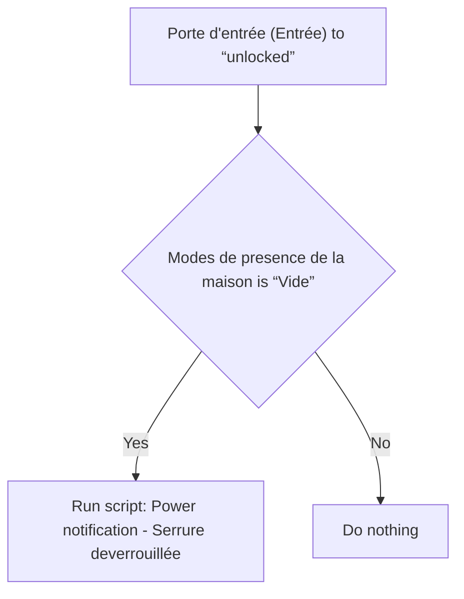
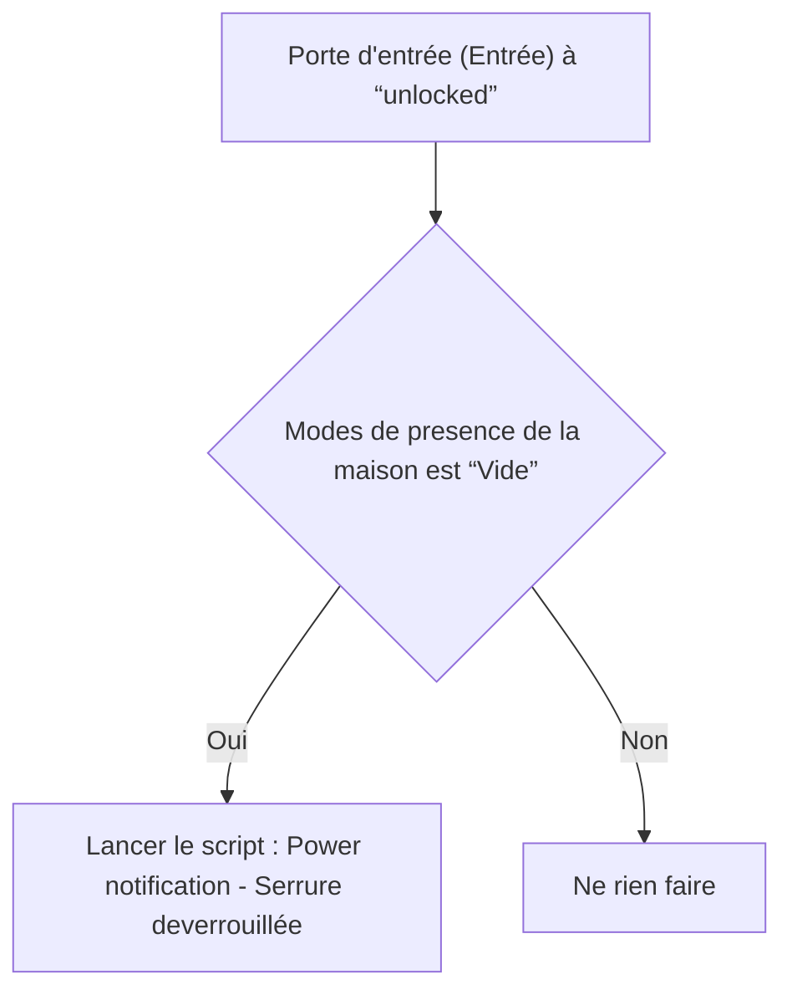

# Serrure - 🔔 Notifier déverrouillage non planifié / Serrure - 🔔 Notifier déverrouillage non planifié

## English
- Back to guest-friendly view: [home_security_and_safety](../../../aspects/home_security_and_safety.md)
- Back to technical aspect index: [home_security_and_safety](../home_security_and_safety.md)

### Summary
- Runs when: Porte d'entrée (Entrée) to “unlocked”
- Only if: Modes de presence de la maison is “Vide”
- Then: Run script: Power notification - Serrure deverrouillée

### Scripts called
- [Power notification - Serrure deverrouillée](../../scripts/power_notification_serrure_deverrouillee.md)

## Français
- Retour vers la vue “invité” : [home_security_and_safety](../../../aspects/home_security_and_safety.md)
- Retour vers l’index technique de l’aspect : [home_security_and_safety](../home_security_and_safety.md)

### Résumé
- Se déclenche quand : Porte d'entrée (Entrée) à “unlocked”
- Uniquement si : Modes de presence de la maison est “Vide”
- Ensuite : Lancer le script : Power notification - Serrure deverrouillée

### Scripts appelés
- [Power notification - Serrure deverrouillée](../../scripts/power_notification_serrure_deverrouillee.md)

