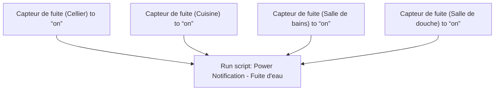
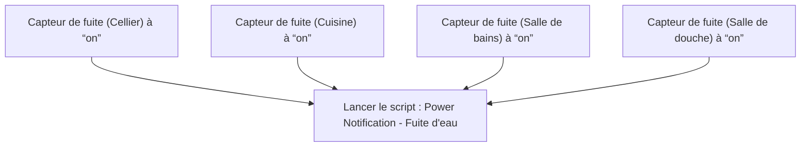

# Fuite d'eau - 🔔 Notifier / Fuite d'eau - 🔔 Notifier

## English
- Back to guest-friendly view: [home_security_and_safety](../../../aspects/home_security_and_safety.md)
- Back to technical aspect index: [home_security_and_safety](../home_security_and_safety.md)

### Summary
- Runs when: Capteur de fuite (Cellier) to “on”; Capteur de fuite (Cuisine) to “on”; Capteur de fuite (Salle de bains) to “on”; Capteur de fuite (Salle de douche) to “on”
- Only if: No extra conditions
- Then: Run script: Power Notification - Fuite d'eau

### Scripts called
- [Power Notification - Fuite d'eau](../../scripts/power_notification_fuite_d_eau.md)

## Français
- Retour vers la vue “invité” : [home_security_and_safety](../../../aspects/home_security_and_safety.md)
- Retour vers l’index technique de l’aspect : [home_security_and_safety](../home_security_and_safety.md)

### Résumé
- Se déclenche quand : Capteur de fuite (Cellier) à “on”; Capteur de fuite (Cuisine) à “on”; Capteur de fuite (Salle de bains) à “on”; Capteur de fuite (Salle de douche) à “on”
- Uniquement si : Pas de condition supplémentaire
- Ensuite : Lancer le script : Power Notification - Fuite d'eau

### Scripts appelés
- [Power Notification - Fuite d'eau](../../scripts/power_notification_fuite_d_eau.md)

