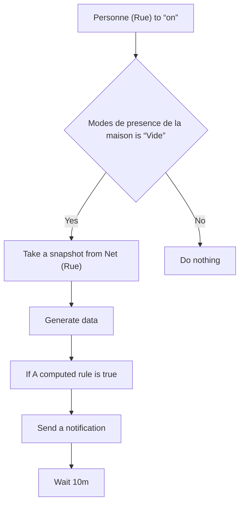
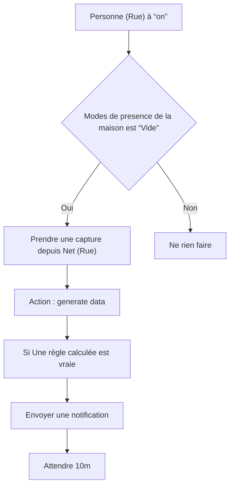

# Sonnette vidéo - Notifications importante / Sonnette vidéo - Notifications importante

## English
- Back to guest-friendly view: [home_security_and_safety](../../../aspects/home_security_and_safety.md)
- Back to technical aspect index: [home_security_and_safety](../home_security_and_safety.md)

### Summary
- Runs when: Personne (Rue) to “on”
- Only if: Modes de presence de la maison is “Vide”
- Then: Take a snapshot from Net (Rue); Generate data; If A computed rule is true; Send a notification; Wait 10m

## Français
- Retour vers la vue “invité” : [home_security_and_safety](../../../aspects/home_security_and_safety.md)
- Retour vers l’index technique de l’aspect : [home_security_and_safety](../home_security_and_safety.md)

### Résumé
- Se déclenche quand : Personne (Rue) à “on”
- Uniquement si : Modes de presence de la maison est “Vide”
- Ensuite : Prendre une capture depuis Net (Rue); Action : generate data; Si Une règle calculée est vraie; Envoyer une notification; Attendre 10m

