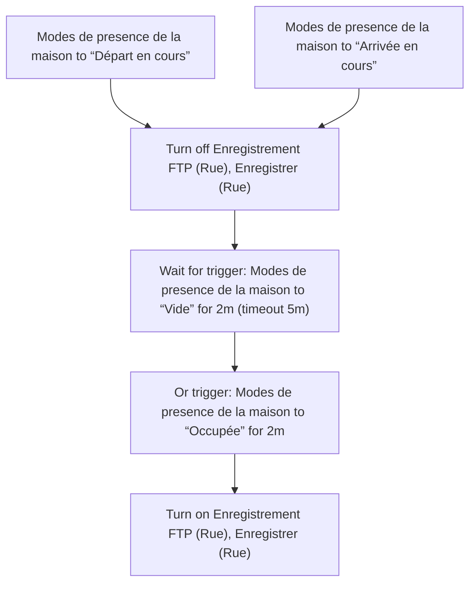
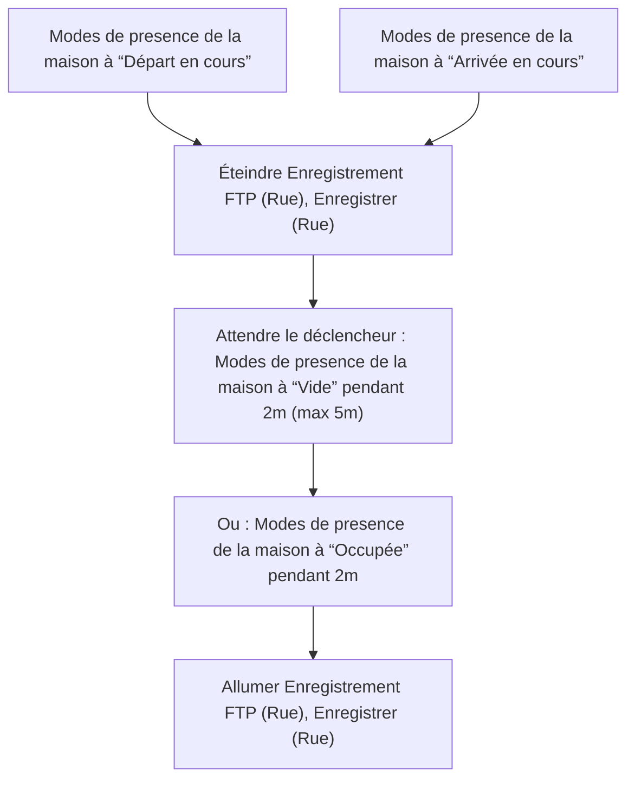

# Sonnette vidéo - Ne pas enregistrer lors du départ/arrivée / Sonnette vidéo - Ne pas enregistrer lors du départ/arrivée

## English
- Back to guest-friendly view: [home_security_and_safety](../../../aspects/home_security_and_safety.md)
- Back to technical aspect index: [home_security_and_safety](../home_security_and_safety.md)

### Summary
- Runs when: Modes de presence de la maison to “Départ en cours”; Modes de presence de la maison to “Arrivée en cours”
- Only if: No extra conditions
- Then: Turn off Enregistrement FTP (Rue), Enregistrer (Rue); Wait for trigger: Modes de presence de la maison to “Vide” for 2m (timeout 5m); Or trigger: Modes de presence de la maison to “Occupée” for 2m; Turn on Enregistrement FTP (Rue), Enregistrer (Rue)

## Français
- Retour vers la vue “invité” : [home_security_and_safety](../../../aspects/home_security_and_safety.md)
- Retour vers l’index technique de l’aspect : [home_security_and_safety](../home_security_and_safety.md)

### Résumé
- Se déclenche quand : Modes de presence de la maison à “Départ en cours”; Modes de presence de la maison à “Arrivée en cours”
- Uniquement si : Pas de condition supplémentaire
- Ensuite : Éteindre Enregistrement FTP (Rue), Enregistrer (Rue); Attendre le déclencheur : Modes de presence de la maison à “Vide” pendant 2m (max 5m); Ou : Modes de presence de la maison à “Occupée” pendant 2m; Allumer Enregistrement FTP (Rue), Enregistrer (Rue)

