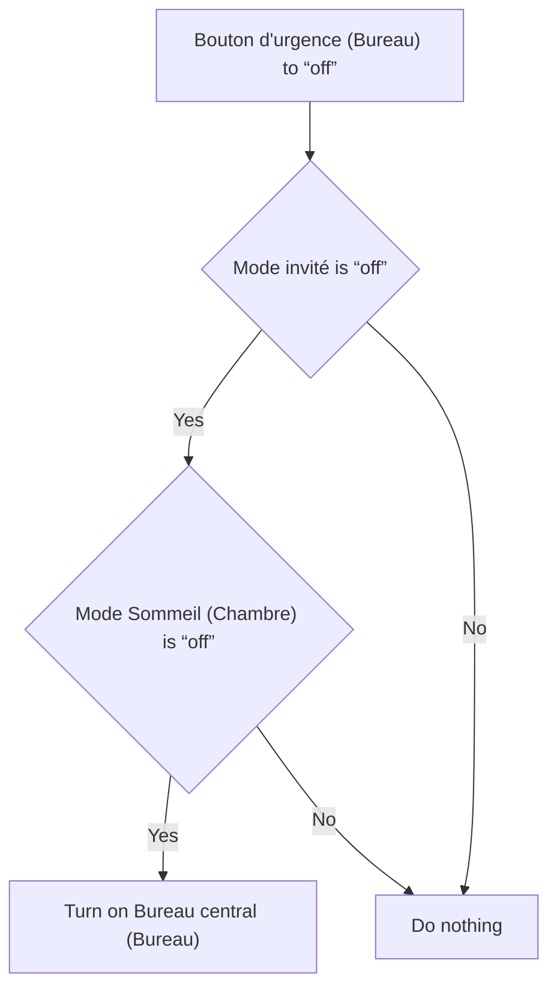

# Bouton urgence - Flash / Bouton urgence - Flash

## English
- Back to guest-friendly view: [home_security_and_safety](../../../aspects/home_security_and_safety.md)
- Back to technical aspect index: [home_security_and_safety](../home_security_and_safety.md)

### Summary
- Runs when: Bouton d'urgence (Bureau) to “off”
- Only if: Mode invité is “off”; Mode Sommeil (Chambre) is “off”
- Then: Turn on Bureau central (Bureau)

## Français
- Retour vers la vue “invité” : [home_security_and_safety](../../../aspects/home_security_and_safety.md)
- Retour vers l’index technique de l’aspect : [home_security_and_safety](../home_security_and_safety.md)

### Résumé
- Se déclenche quand : Bouton d'urgence (Bureau) à “off”
- Uniquement si : Mode invité est “off”; Mode Sommeil (Chambre) est “off”
- Ensuite : Allumer Bureau central (Bureau)

