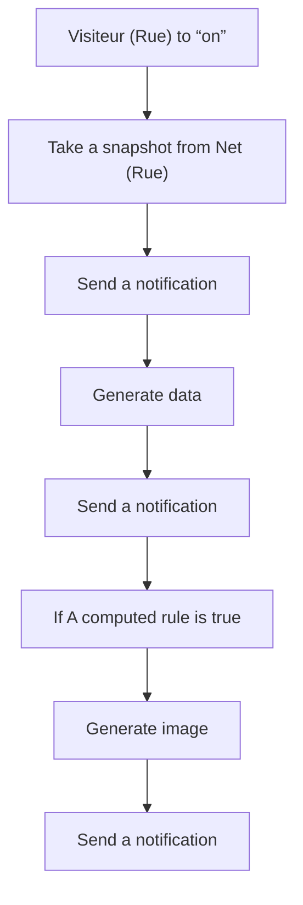
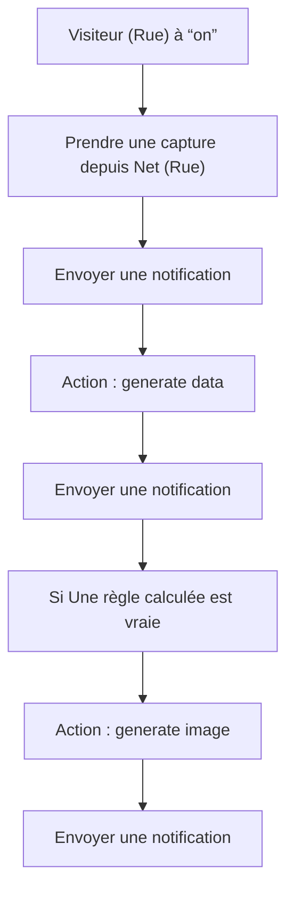

# Sonnette - Description lors de l'appui sur bouton / Sonnette - Description lors de l'appui sur bouton

## English
- Back to guest-friendly view: [home_security_and_safety](../../../aspects/home_security_and_safety.md)
- Back to technical aspect index: [home_security_and_safety](../home_security_and_safety.md)

### Summary
- Runs when: Visiteur (Rue) to “on”
- Only if: No extra conditions
- Then: Take a snapshot from Net (Rue); Send a notification; Generate data; Send a notification; If A computed rule is true; Generate image; Send a notification

## Français
- Retour vers la vue “invité” : [home_security_and_safety](../../../aspects/home_security_and_safety.md)
- Retour vers l’index technique de l’aspect : [home_security_and_safety](../home_security_and_safety.md)

### Résumé
- Se déclenche quand : Visiteur (Rue) à “on”
- Uniquement si : Pas de condition supplémentaire
- Ensuite : Prendre une capture depuis Net (Rue); Envoyer une notification; Action : generate data; Envoyer une notification; Si Une règle calculée est vraie; Action : generate image; Envoyer une notification

