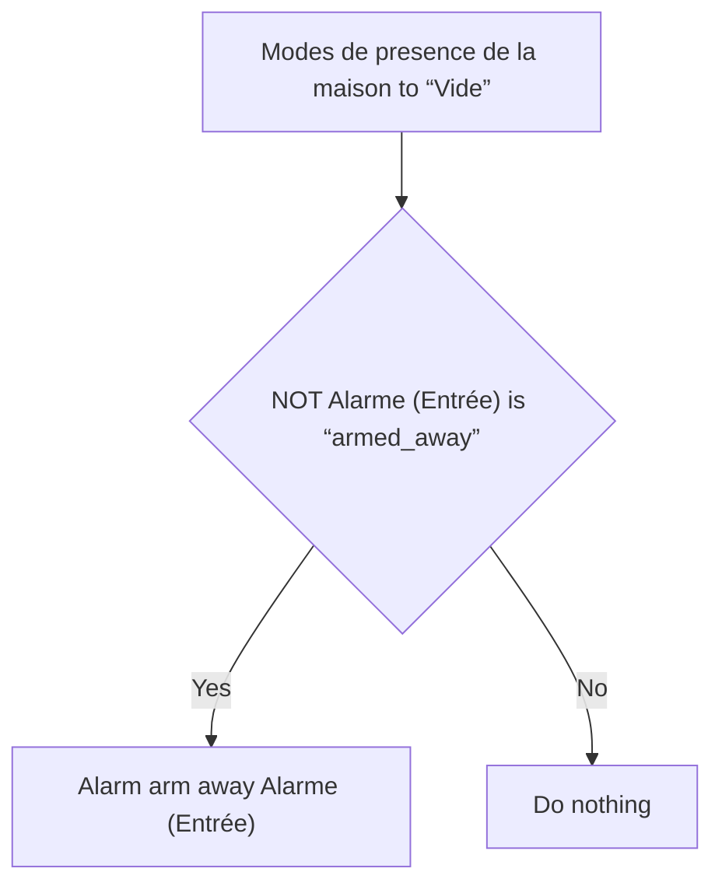
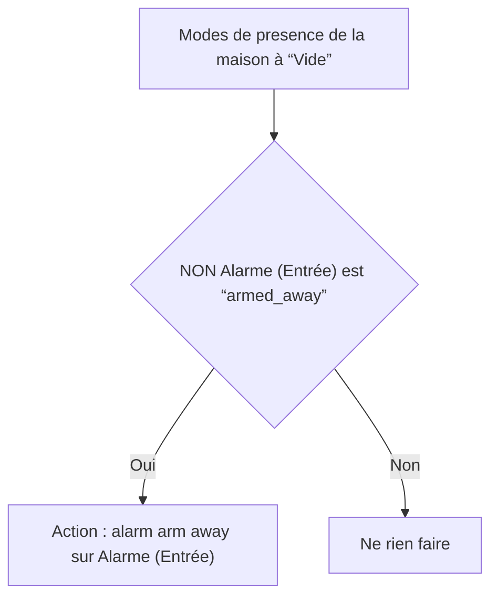

# Alarme - Armer lors du départ / Alarme - Armer lors du départ

## English
- Back to guest-friendly view: [home_security_and_safety](../../../aspects/home_security_and_safety.md)
- Back to technical aspect index: [home_security_and_safety](../home_security_and_safety.md)

### Summary
- Runs when: Modes de presence de la maison to “Vide”
- Only if: NOT (Alarme (Entrée) is “armed_away”)
- Then: Alarm arm away Alarme (Entrée)

## Français
- Retour vers la vue “invité” : [home_security_and_safety](../../../aspects/home_security_and_safety.md)
- Retour vers l’index technique de l’aspect : [home_security_and_safety](../home_security_and_safety.md)

### Résumé
- Se déclenche quand : Modes de presence de la maison à “Vide”
- Uniquement si : NON (Alarme (Entrée) est “armed_away”)
- Ensuite : Action : alarm arm away sur Alarme (Entrée)

