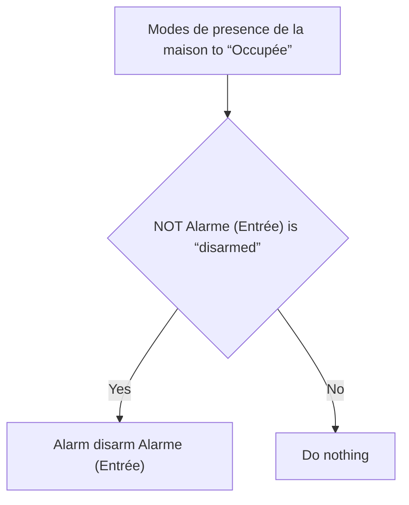

# Alarme - Désarmer lors de l'arrivée / Alarme - Désarmer lors de l'arrivée

## English
- Back to guest-friendly view: [home_security_and_safety](../../../aspects/home_security_and_safety.md)
- Back to technical aspect index: [home_security_and_safety](../home_security_and_safety.md)

### Summary
- Runs when: Modes de presence de la maison to “Occupée”
- Only if: NOT (Alarme (Entrée) is “disarmed”)
- Then: Alarm disarm Alarme (Entrée)

## Français
- Retour vers la vue “invité” : [home_security_and_safety](../../../aspects/home_security_and_safety.md)
- Retour vers l’index technique de l’aspect : [home_security_and_safety](../home_security_and_safety.md)

### Résumé
- Se déclenche quand : Modes de presence de la maison à “Occupée”
- Uniquement si : NON (Alarme (Entrée) est “disarmed”)
- Ensuite : Action : alarm disarm sur Alarme (Entrée)

