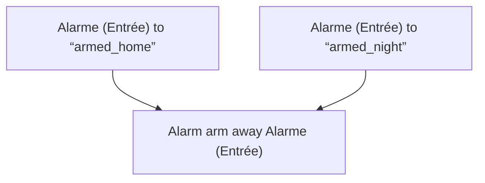
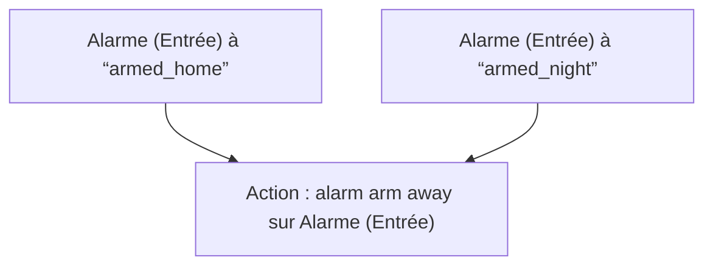

# Alarme - Armer Fallback / Alarme - Armer Fallback

## English
- Back to guest-friendly view: [home_security_and_safety](../../../aspects/home_security_and_safety.md)
- Back to technical aspect index: [home_security_and_safety](../home_security_and_safety.md)

### Summary
- Runs when: Alarme (Entrée) to “armed_home”; Alarme (Entrée) to “armed_night”
- Only if: No extra conditions
- Then: Alarm arm away Alarme (Entrée)

## Français
- Retour vers la vue “invité” : [home_security_and_safety](../../../aspects/home_security_and_safety.md)
- Retour vers l’index technique de l’aspect : [home_security_and_safety](../home_security_and_safety.md)

### Résumé
- Se déclenche quand : Alarme (Entrée) à “armed_home”; Alarme (Entrée) à “armed_night”
- Uniquement si : Pas de condition supplémentaire
- Ensuite : Action : alarm arm away sur Alarme (Entrée)

