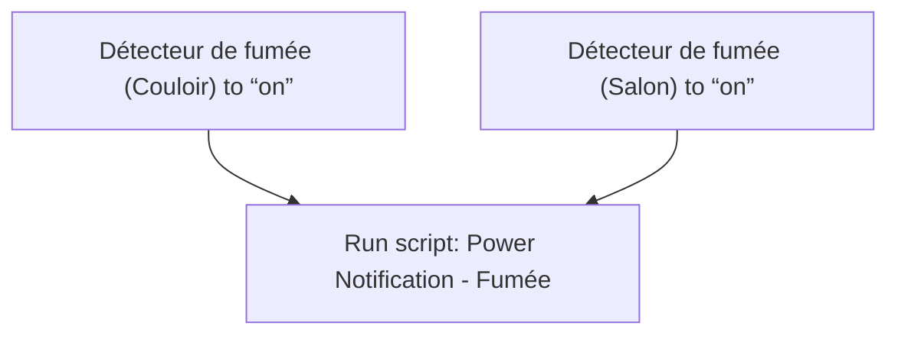
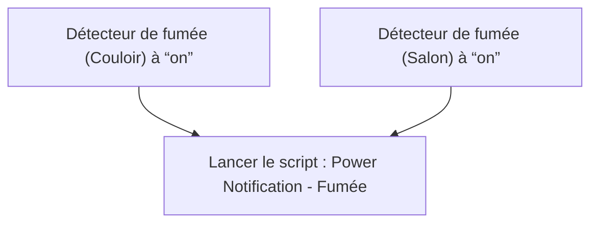

# Fumée - 🔔 Notifier / Fumée - 🔔 Notifier

## English
- Back to guest-friendly view: [home_security_and_safety](../../../aspects/home_security_and_safety.md)
- Back to technical aspect index: [home_security_and_safety](../home_security_and_safety.md)

### Summary
- Runs when: Détecteur de fumée (Couloir) to “on”; Détecteur de fumée (Salon) to “on”
- Only if: No extra conditions
- Then: Run script: Power Notification - Fumée

### Scripts called
- [Power Notification - Fumée](../../scripts/power_notification_fumee.md)

## Français
- Retour vers la vue “invité” : [home_security_and_safety](../../../aspects/home_security_and_safety.md)
- Retour vers l’index technique de l’aspect : [home_security_and_safety](../home_security_and_safety.md)

### Résumé
- Se déclenche quand : Détecteur de fumée (Couloir) à “on”; Détecteur de fumée (Salon) à “on”
- Uniquement si : Pas de condition supplémentaire
- Ensuite : Lancer le script : Power Notification - Fumée

### Scripts appelés
- [Power Notification - Fumée](../../scripts/power_notification_fumee.md)

