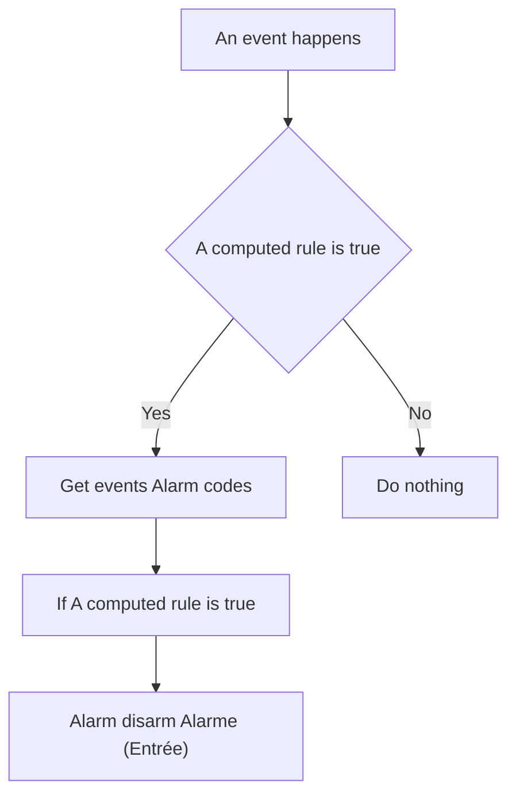
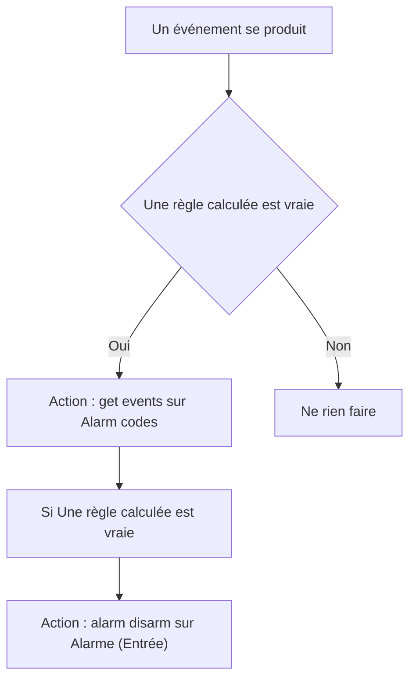

# Alarme - Code personnalisés / Alarme - Code personnalisés

## English
- Back to guest-friendly view: [home_security_and_safety](../../../aspects/home_security_and_safety.md)
- Back to technical aspect index: [home_security_and_safety](../home_security_and_safety.md)

### Summary
- Runs when: An event happens
- Only if: A computed rule is true
- Then: Get events Alarm codes; If A computed rule is true; Alarm disarm Alarme (Entrée)

## Français
- Retour vers la vue “invité” : [home_security_and_safety](../../../aspects/home_security_and_safety.md)
- Retour vers l’index technique de l’aspect : [home_security_and_safety](../home_security_and_safety.md)

### Résumé
- Se déclenche quand : Un événement se produit
- Uniquement si : Une règle calculée est vraie
- Ensuite : Action : get events sur Alarm codes; Si Une règle calculée est vraie; Action : alarm disarm sur Alarme (Entrée)

