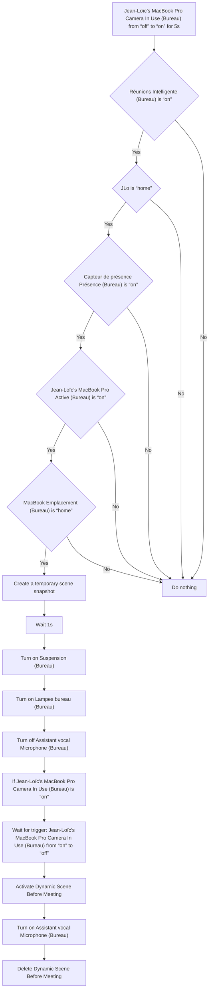
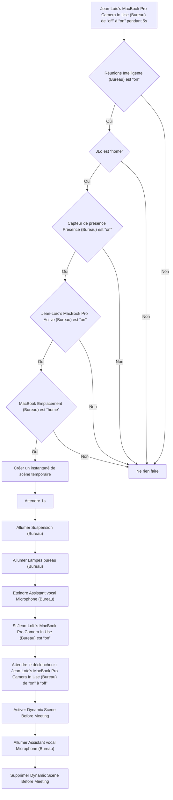

# Bureau - Meetings / Bureau - Meetings

## English
- Back to guest-friendly view: [other_background](../../../aspects/other_background.md)
- Back to technical aspect index: [other_background](../other_background.md)

### Summary
- Runs when: Jean-Loïc’s MacBook Pro Camera In Use (Bureau) from “off” to “on” for 5s
- Only if: Réunions Intelligente (Bureau) is “on”; JLo is “home”; Capteur de présence Présence (Bureau) is “on”; Jean-Loïc’s MacBook Pro Active (Bureau) is “on”; MacBook Emplacement (Bureau) is “home”
- Then: Create a temporary scene snapshot; Wait 1s; Turn on Suspension (Bureau); Turn on Lampes bureau (Bureau); Turn off Assistant vocal Microphone (Bureau); If Jean-Loïc’s MacBook Pro Camera In Use (Bureau) is “on”; Wait for trigger: Jean-Loïc’s MacBook Pro Camera In Use (Bureau) from “on” to “off”; Activate Dynamic Scene Before Meeting; Turn on Assistant vocal Microphone (Bureau); Delete Dynamic Scene Before Meeting

## Français
- Retour vers la vue “invité” : [other_background](../../../aspects/other_background.md)
- Retour vers l’index technique de l’aspect : [other_background](../other_background.md)

### Résumé
- Se déclenche quand : Jean-Loïc’s MacBook Pro Camera In Use (Bureau) de “off” à “on” pendant 5s
- Uniquement si : Réunions Intelligente (Bureau) est “on”; JLo est “home”; Capteur de présence Présence (Bureau) est “on”; Jean-Loïc’s MacBook Pro Active (Bureau) est “on”; MacBook Emplacement (Bureau) est “home”
- Ensuite : Créer un instantané de scène temporaire; Attendre 1s; Allumer Suspension (Bureau); Allumer Lampes bureau (Bureau); Éteindre Assistant vocal Microphone (Bureau); Si Jean-Loïc’s MacBook Pro Camera In Use (Bureau) est “on”; Attendre le déclencheur : Jean-Loïc’s MacBook Pro Camera In Use (Bureau) de “on” à “off”; Activer Dynamic Scene Before Meeting; Allumer Assistant vocal Microphone (Bureau); Supprimer Dynamic Scene Before Meeting

