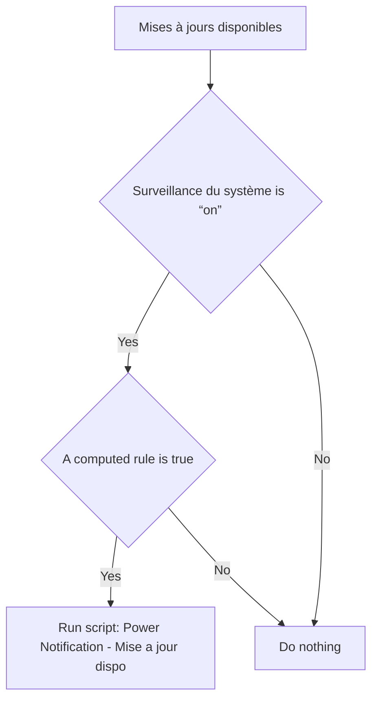
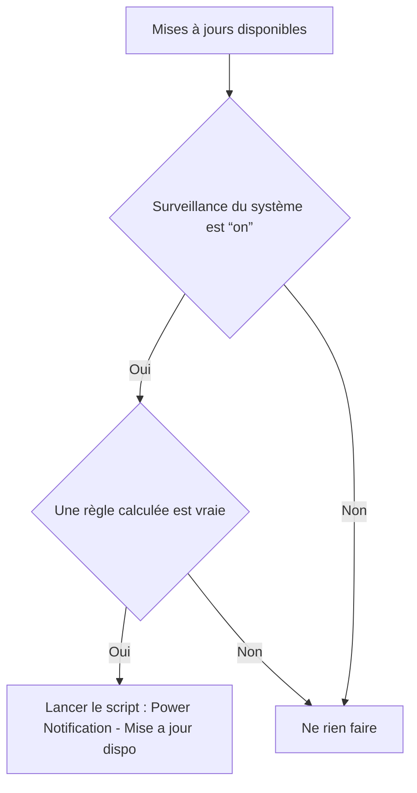

# Surveillance du système - 🔔 Notifier mise a jour dispo / Surveillance du système - 🔔 Notifier mise a jour dispo

## English
- Back to guest-friendly view: [other_background](../../../aspects/other_background.md)
- Back to technical aspect index: [other_background](../other_background.md)

### Summary
- Runs when: Mises à jours disponibles
- Only if: Surveillance du système is “on”; A computed rule is true
- Then: Run script: Power Notification - Mise a jour dispo

### Scripts called
- [Power Notification - Mise a jour dispo](../../scripts/power_notification_mise_a_jour_dispo.md)

## Français
- Retour vers la vue “invité” : [other_background](../../../aspects/other_background.md)
- Retour vers l’index technique de l’aspect : [other_background](../other_background.md)

### Résumé
- Se déclenche quand : Mises à jours disponibles
- Uniquement si : Surveillance du système est “on”; Une règle calculée est vraie
- Ensuite : Lancer le script : Power Notification - Mise a jour dispo

### Scripts appelés
- [Power Notification - Mise a jour dispo](../../scripts/power_notification_mise_a_jour_dispo.md)

