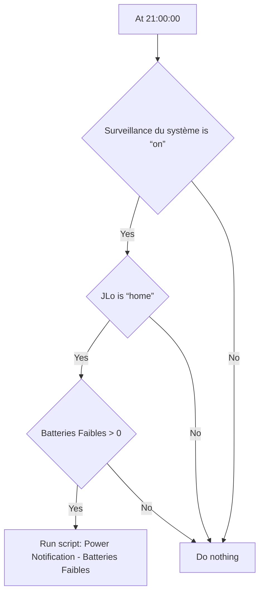
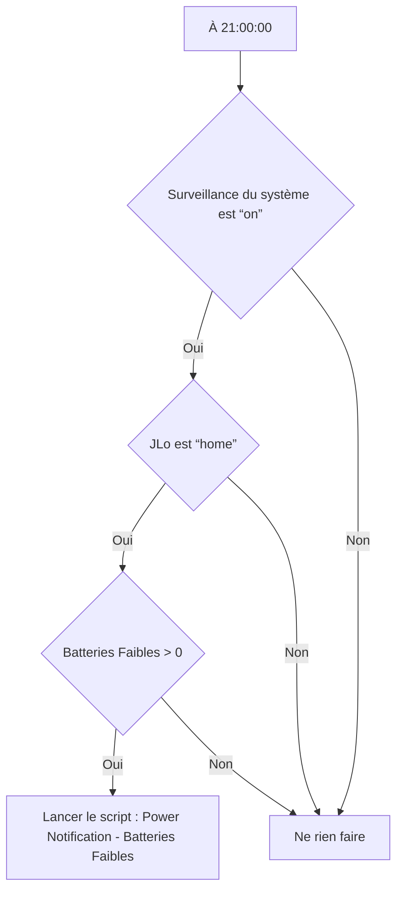

# Surveillance du système - 🔔 Notifier batteries faibles / Surveillance du système - 🔔 Notifier batteries faibles

## English
- Back to guest-friendly view: [other_background](../../../aspects/other_background.md)
- Back to technical aspect index: [other_background](../other_background.md)

### Summary
- Runs when: At 21:00:00
- Only if: Surveillance du système is “on”; JLo is “home”; Batteries Faibles > 0
- Then: Run script: Power Notification - Batteries Faibles

### Scripts called
- [Power Notification - Batteries Faibles](../../scripts/power_notification_batteries_faibles.md)

## Français
- Retour vers la vue “invité” : [other_background](../../../aspects/other_background.md)
- Retour vers l’index technique de l’aspect : [other_background](../other_background.md)

### Résumé
- Se déclenche quand : À 21:00:00
- Uniquement si : Surveillance du système est “on”; JLo est “home”; Batteries Faibles > 0
- Ensuite : Lancer le script : Power Notification - Batteries Faibles

### Scripts appelés
- [Power Notification - Batteries Faibles](../../scripts/power_notification_batteries_faibles.md)

