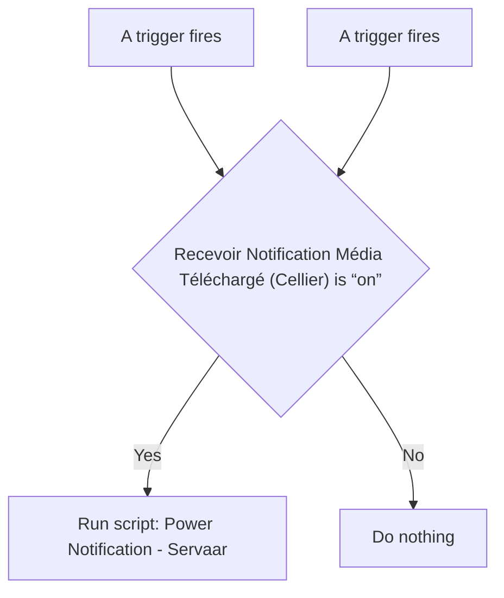
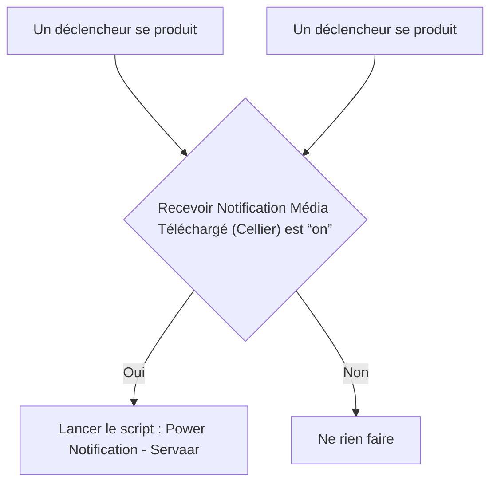

# Servarr - 🔔 Notification / Servarr - 🔔 Notification

## English
- Back to guest-friendly view: [other_background](../../../aspects/other_background.md)
- Back to technical aspect index: [other_background](../other_background.md)

### Summary
- Runs when: A trigger fires; A trigger fires
- Only if: Recevoir Notification Média Téléchargé (Cellier) is “on”
- Then: Run script: Power Notification - Servaar

### Scripts called
- [Power Notification - Servaar](../../scripts/power_notification_servaar.md)

## Français
- Retour vers la vue “invité” : [other_background](../../../aspects/other_background.md)
- Retour vers l’index technique de l’aspect : [other_background](../other_background.md)

### Résumé
- Se déclenche quand : Un déclencheur se produit; Un déclencheur se produit
- Uniquement si : Recevoir Notification Média Téléchargé (Cellier) est “on”
- Ensuite : Lancer le script : Power Notification - Servaar

### Scripts appelés
- [Power Notification - Servaar](../../scripts/power_notification_servaar.md)

