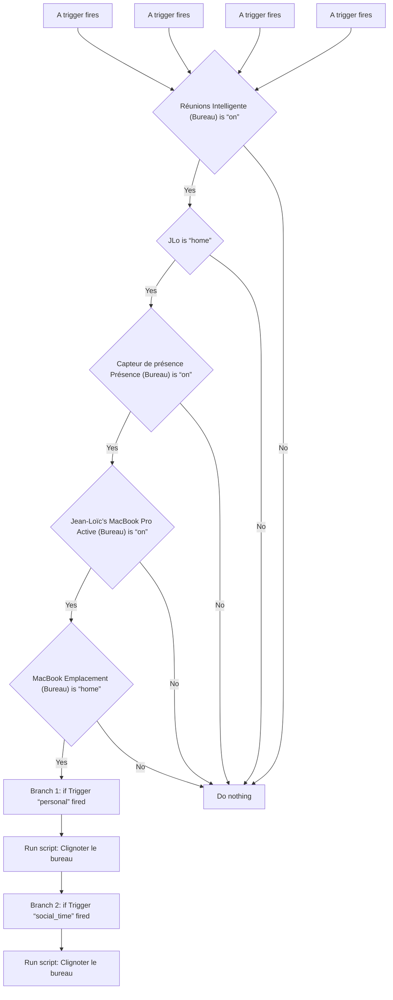
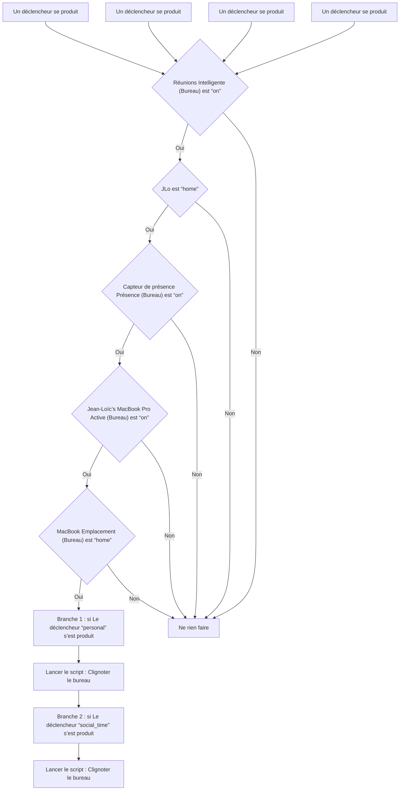

# Bureau - Notification Lumineuse Meetings / Bureau - Notification Lumineuse Meetings

## English
- Back to guest-friendly view: [other_background](../../../aspects/other_background.md)
- Back to technical aspect index: [other_background](../other_background.md)

### Summary
- Runs when: A trigger fires; A trigger fires; A trigger fires; A trigger fires
- Only if: Réunions Intelligente (Bureau) is “on”; JLo is “home”; Capteur de présence Présence (Bureau) is “on”; Jean-Loïc’s MacBook Pro Active (Bureau) is “on”; MacBook Emplacement (Bureau) is “home”
- Then: Branch 1: if Trigger “personal” fired; Run script: Clignoter le bureau; Branch 2: if Trigger “social_time” fired; Run script: Clignoter le bureau

### Scripts called
- [Clignoter le bureau](../../scripts/clignoter_le_dessous_de_bureau.md)

## Français
- Retour vers la vue “invité” : [other_background](../../../aspects/other_background.md)
- Retour vers l’index technique de l’aspect : [other_background](../other_background.md)

### Résumé
- Se déclenche quand : Un déclencheur se produit; Un déclencheur se produit; Un déclencheur se produit; Un déclencheur se produit
- Uniquement si : Réunions Intelligente (Bureau) est “on”; JLo est “home”; Capteur de présence Présence (Bureau) est “on”; Jean-Loïc’s MacBook Pro Active (Bureau) est “on”; MacBook Emplacement (Bureau) est “home”
- Ensuite : Branche 1 : si Le déclencheur “personal” s’est produit; Lancer le script : Clignoter le bureau; Branche 2 : si Le déclencheur “social_time” s’est produit; Lancer le script : Clignoter le bureau

### Scripts appelés
- [Clignoter le bureau](../../scripts/clignoter_le_dessous_de_bureau.md)

