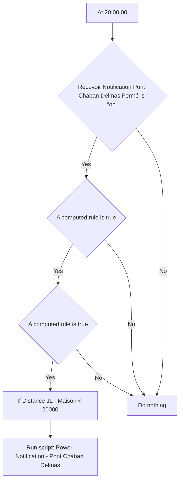
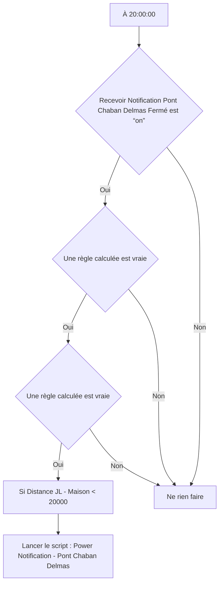

# Pont Chaban Delmas - 🛎️ Notifier fermeture demain / Pont Chaban Delmas - 🛎️ Notifier fermeture demain

## English
- Back to guest-friendly view: [other_background](../../../aspects/other_background.md)
- Back to technical aspect index: [other_background](../other_background.md)

### Summary
- Runs when: At 20:00:00
- Only if: Recevoir Notification Pont Chaban Delmas Fermé is “on”; A computed rule is true; A computed rule is true
- Then: If Distance JL - Maison < 20000; Run script: Power Notification - Pont Chaban Delmas

### Scripts called
- [Power Notification - Pont Chaban Delmas](../../scripts/power_notification_pont_chaban_delmas.md)

## Français
- Retour vers la vue “invité” : [other_background](../../../aspects/other_background.md)
- Retour vers l’index technique de l’aspect : [other_background](../other_background.md)

### Résumé
- Se déclenche quand : À 20:00:00
- Uniquement si : Recevoir Notification Pont Chaban Delmas Fermé est “on”; Une règle calculée est vraie; Une règle calculée est vraie
- Ensuite : Si Distance JL - Maison < 20000; Lancer le script : Power Notification - Pont Chaban Delmas

### Scripts appelés
- [Power Notification - Pont Chaban Delmas](../../scripts/power_notification_pont_chaban_delmas.md)

