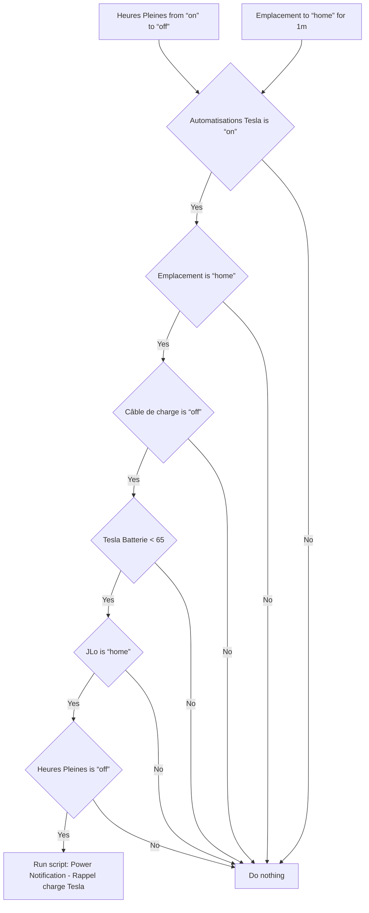
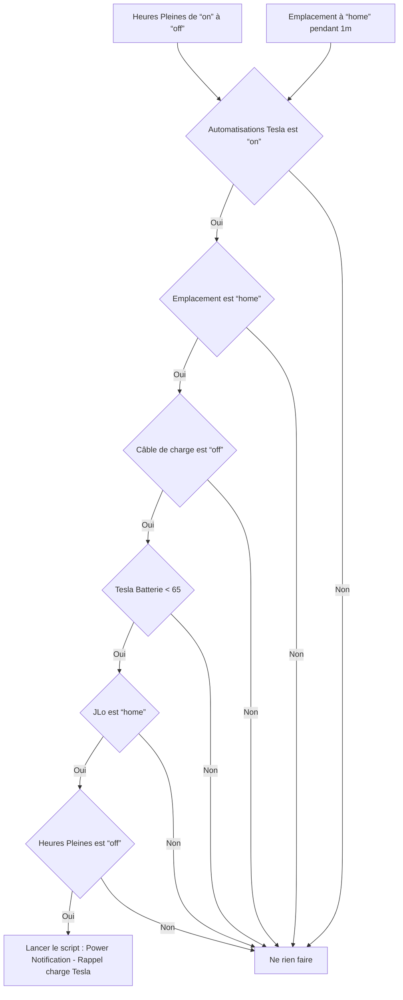

# Tesla - 🔔 Rappel charge / Tesla - 🔔 Rappel charge

## English
- Back to guest-friendly view: [other_background](../../../aspects/other_background.md)
- Back to technical aspect index: [other_background](../other_background.md)

### Summary
- Runs when: Heures Pleines from “on” to “off”; Emplacement to “home” for 1m
- Only if: Automatisations Tesla is “on”; Emplacement is “home”; Câble de charge is “off”; Tesla Batterie < 65; JLo is “home”; Heures Pleines is “off”
- Then: Run script: Power Notification - Rappel charge Tesla

### Scripts called
- [Power Notification - Rappel charge Tesla](../../scripts/power_notification_rappel_charge_tesla.md)

## Français
- Retour vers la vue “invité” : [other_background](../../../aspects/other_background.md)
- Retour vers l’index technique de l’aspect : [other_background](../other_background.md)

### Résumé
- Se déclenche quand : Heures Pleines de “on” à “off”; Emplacement à “home” pendant 1m
- Uniquement si : Automatisations Tesla est “on”; Emplacement est “home”; Câble de charge est “off”; Tesla Batterie < 65; JLo est “home”; Heures Pleines est “off”
- Ensuite : Lancer le script : Power Notification - Rappel charge Tesla

### Scripts appelés
- [Power Notification - Rappel charge Tesla](../../scripts/power_notification_rappel_charge_tesla.md)

