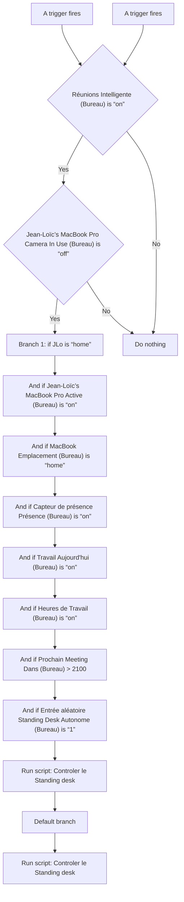
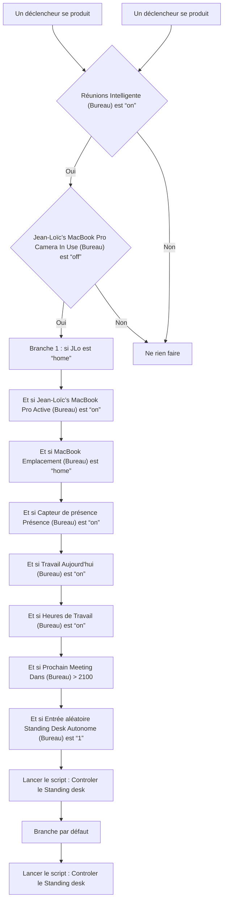

# Bureau - Standing Desk Autonome / Bureau - Standing Desk Autonome

## English
- Back to guest-friendly view: [other_background](../../../aspects/other_background.md)
- Back to technical aspect index: [other_background](../other_background.md)

### Summary
- Runs when: A trigger fires; A trigger fires
- Only if: Réunions Intelligente (Bureau) is “on”; Jean-Loïc’s MacBook Pro Camera In Use (Bureau) is “off”
- Then: Branch 1: if JLo is “home”; And if Jean-Loïc’s MacBook Pro Active (Bureau) is “on”; And if MacBook Emplacement (Bureau) is “home”; And if Capteur de présence Présence (Bureau) is “on”; And if Travail Aujourd'hui (Bureau) is “on”; And if Heures de Travail (Bureau) is “on”; And if Prochain Meeting Dans (Bureau) > 2100; And if Entrée aléatoire Standing Desk Autonome (Bureau) is “1”; Run script: Controler le Standing desk; Default branch; Run script: Controler le Standing desk

### Scripts called
- [Controler le Standing desk](../../scripts/controler_le_standing_desk.md)

## Français
- Retour vers la vue “invité” : [other_background](../../../aspects/other_background.md)
- Retour vers l’index technique de l’aspect : [other_background](../other_background.md)

### Résumé
- Se déclenche quand : Un déclencheur se produit; Un déclencheur se produit
- Uniquement si : Réunions Intelligente (Bureau) est “on”; Jean-Loïc’s MacBook Pro Camera In Use (Bureau) est “off”
- Ensuite : Branche 1 : si JLo est “home”; Et si Jean-Loïc’s MacBook Pro Active (Bureau) est “on”; Et si MacBook Emplacement (Bureau) est “home”; Et si Capteur de présence Présence (Bureau) est “on”; Et si Travail Aujourd'hui (Bureau) est “on”; Et si Heures de Travail (Bureau) est “on”; Et si Prochain Meeting Dans (Bureau) > 2100; Et si Entrée aléatoire Standing Desk Autonome (Bureau) est “1”; Lancer le script : Controler le Standing desk; Branche par défaut; Lancer le script : Controler le Standing desk

### Scripts appelés
- [Controler le Standing desk](../../scripts/controler_le_standing_desk.md)

