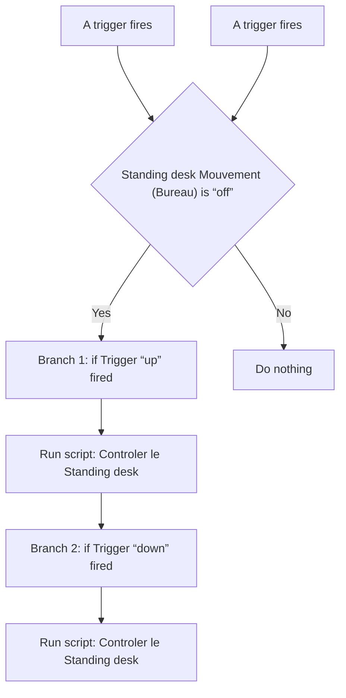
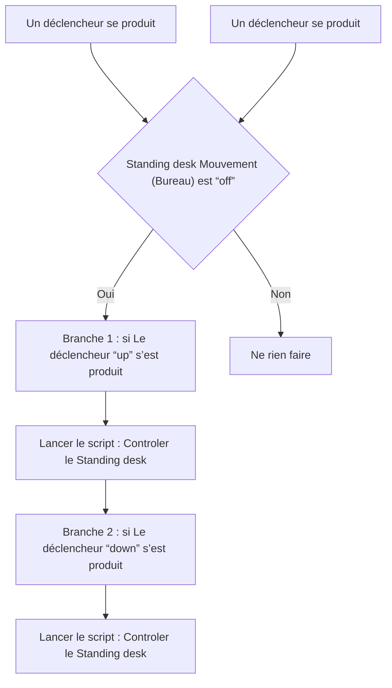

# Bureau - 📣 Contrôle du Standing Desk par la voix / Bureau - 📣 Contrôle du Standing Desk par la voix

## English
- Back to guest-friendly view: [other_background](../../../aspects/other_background.md)
- Back to technical aspect index: [other_background](../other_background.md)

### Summary
- Runs when: A trigger fires; A trigger fires
- Only if: Standing desk Mouvement (Bureau) is “off”
- Then: Branch 1: if Trigger “up” fired; Run script: Controler le Standing desk; Branch 2: if Trigger “down” fired; Run script: Controler le Standing desk

### Scripts called
- [Controler le Standing desk](../../scripts/controler_le_standing_desk.md)

## Français
- Retour vers la vue “invité” : [other_background](../../../aspects/other_background.md)
- Retour vers l’index technique de l’aspect : [other_background](../other_background.md)

### Résumé
- Se déclenche quand : Un déclencheur se produit; Un déclencheur se produit
- Uniquement si : Standing desk Mouvement (Bureau) est “off”
- Ensuite : Branche 1 : si Le déclencheur “up” s’est produit; Lancer le script : Controler le Standing desk; Branche 2 : si Le déclencheur “down” s’est produit; Lancer le script : Controler le Standing desk

### Scripts appelés
- [Controler le Standing desk](../../scripts/controler_le_standing_desk.md)

