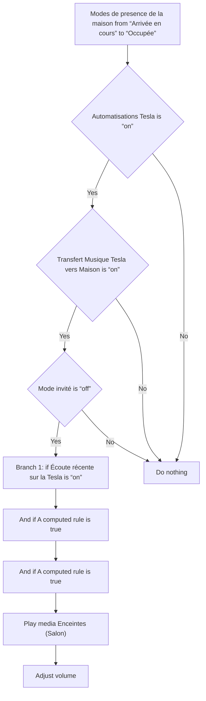
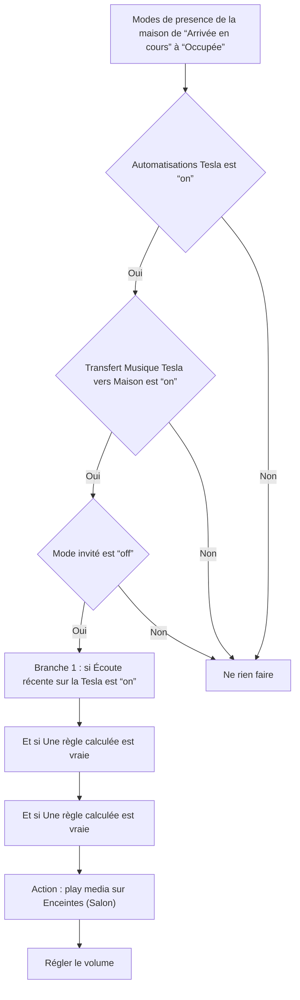

# Transfert Musique Tesla vers Maison - Transférer Musique / Transfert Musique Tesla vers Maison - Transférer Musique

## English
- Back to guest-friendly view: [other_background](../../../aspects/other_background.md)
- Back to technical aspect index: [other_background](../other_background.md)

### Summary
- Runs when: Modes de presence de la maison from “Arrivée en cours” to “Occupée”
- Only if: Automatisations Tesla is “on”; Transfert Musique Tesla vers Maison is “on”; Mode invité is “off”
- Then: Branch 1: if Écoute récente sur la Tesla is “on”; And if A computed rule is true; And if A computed rule is true; Play media Enceintes (Salon); Adjust volume

## Français
- Retour vers la vue “invité” : [other_background](../../../aspects/other_background.md)
- Retour vers l’index technique de l’aspect : [other_background](../other_background.md)

### Résumé
- Se déclenche quand : Modes de presence de la maison de “Arrivée en cours” à “Occupée”
- Uniquement si : Automatisations Tesla est “on”; Transfert Musique Tesla vers Maison est “on”; Mode invité est “off”
- Ensuite : Branche 1 : si Écoute récente sur la Tesla est “on”; Et si Une règle calculée est vraie; Et si Une règle calculée est vraie; Action : play media sur Enceintes (Salon); Régler le volume

