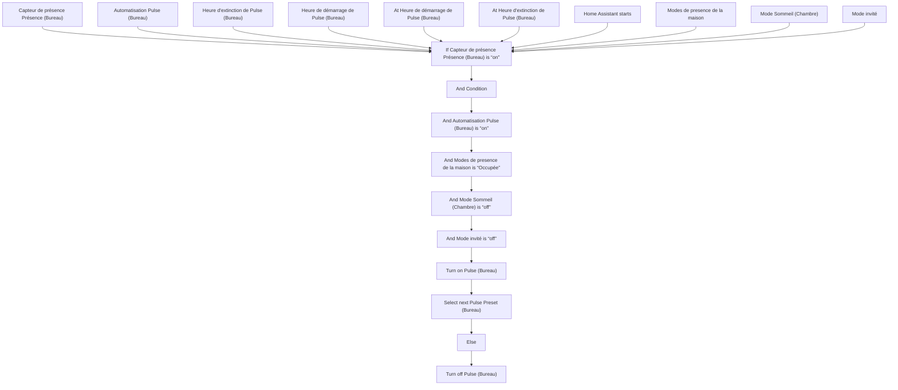
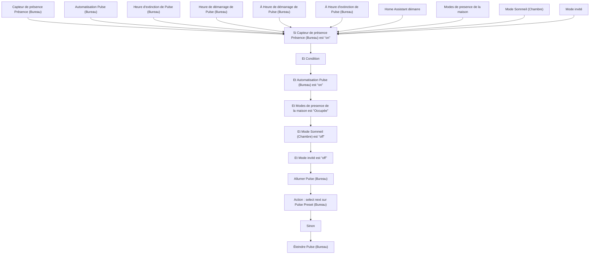

# Pulse - Allumer / Éteindre / Pulse - Allumer / Éteindre

## English
- Back to guest-friendly view: [other_background](../../../aspects/other_background.md)
- Back to technical aspect index: [other_background](../other_background.md)

### Summary
- Runs when: Capteur de présence Présence (Bureau); Automatisation Pulse (Bureau); Heure d'extinction de Pulse (Bureau); Heure de démarrage de Pulse (Bureau); At Heure de démarrage de Pulse (Bureau); At Heure d'extinction de Pulse (Bureau); Home Assistant starts; Modes de presence de la maison; Mode Sommeil (Chambre); Mode invité
- Only if: No extra conditions
- Then: If Capteur de présence Présence (Bureau) is “on”; And Condition; And Automatisation Pulse (Bureau) is “on”; And Modes de presence de la maison is “Occupée”; And Mode Sommeil (Chambre) is “off”; And Mode invité is “off”; Turn on Pulse (Bureau); Select next Pulse Preset (Bureau); Else; Turn off Pulse (Bureau)

## Français
- Retour vers la vue “invité” : [other_background](../../../aspects/other_background.md)
- Retour vers l’index technique de l’aspect : [other_background](../other_background.md)

### Résumé
- Se déclenche quand : Capteur de présence Présence (Bureau); Automatisation Pulse (Bureau); Heure d'extinction de Pulse (Bureau); Heure de démarrage de Pulse (Bureau); À Heure de démarrage de Pulse (Bureau); À Heure d'extinction de Pulse (Bureau); Home Assistant démarre; Modes de presence de la maison; Mode Sommeil (Chambre); Mode invité
- Uniquement si : Pas de condition supplémentaire
- Ensuite : Si Capteur de présence Présence (Bureau) est “on”; Et Condition; Et Automatisation Pulse (Bureau) est “on”; Et Modes de presence de la maison est “Occupée”; Et Mode Sommeil (Chambre) est “off”; Et Mode invité est “off”; Allumer Pulse (Bureau); Action : select next sur Pulse Preset (Bureau); Sinon; Éteindre Pulse (Bureau)

