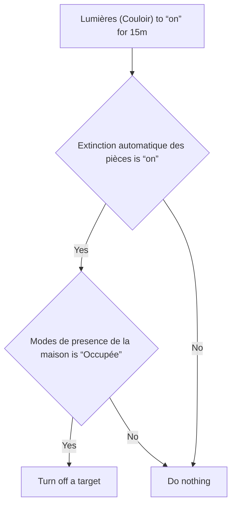
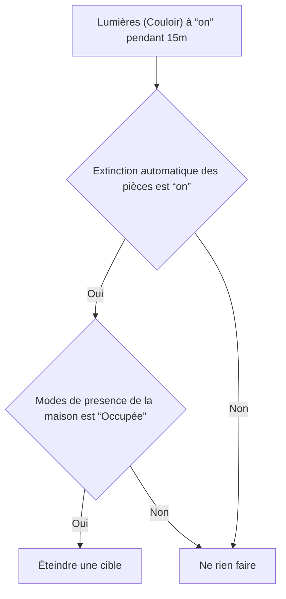

# Éteindre Couloir automatiquement / Éteindre Couloir automatiquement

## English
- Back to guest-friendly view: [other_background](../../../aspects/other_background.md)
- Back to technical aspect index: [other_background](../other_background.md)

### Summary
- Runs when: Lumières (Couloir) to “on” for 15m
- Only if: Extinction automatique des pièces is “on”; Modes de presence de la maison is “Occupée”
- Then: Turn off a target

## Français
- Retour vers la vue “invité” : [other_background](../../../aspects/other_background.md)
- Retour vers l’index technique de l’aspect : [other_background](../other_background.md)

### Résumé
- Se déclenche quand : Lumières (Couloir) à “on” pendant 15m
- Uniquement si : Extinction automatique des pièces est “on”; Modes de presence de la maison est “Occupée”
- Ensuite : Éteindre une cible

