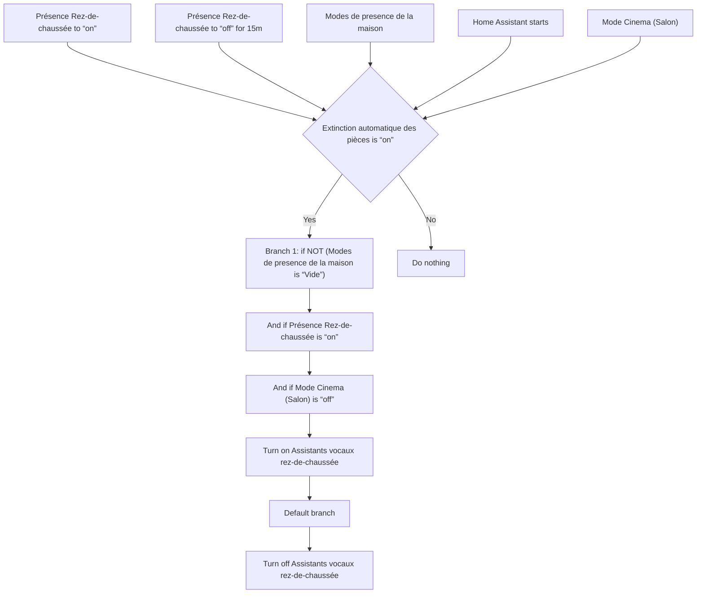
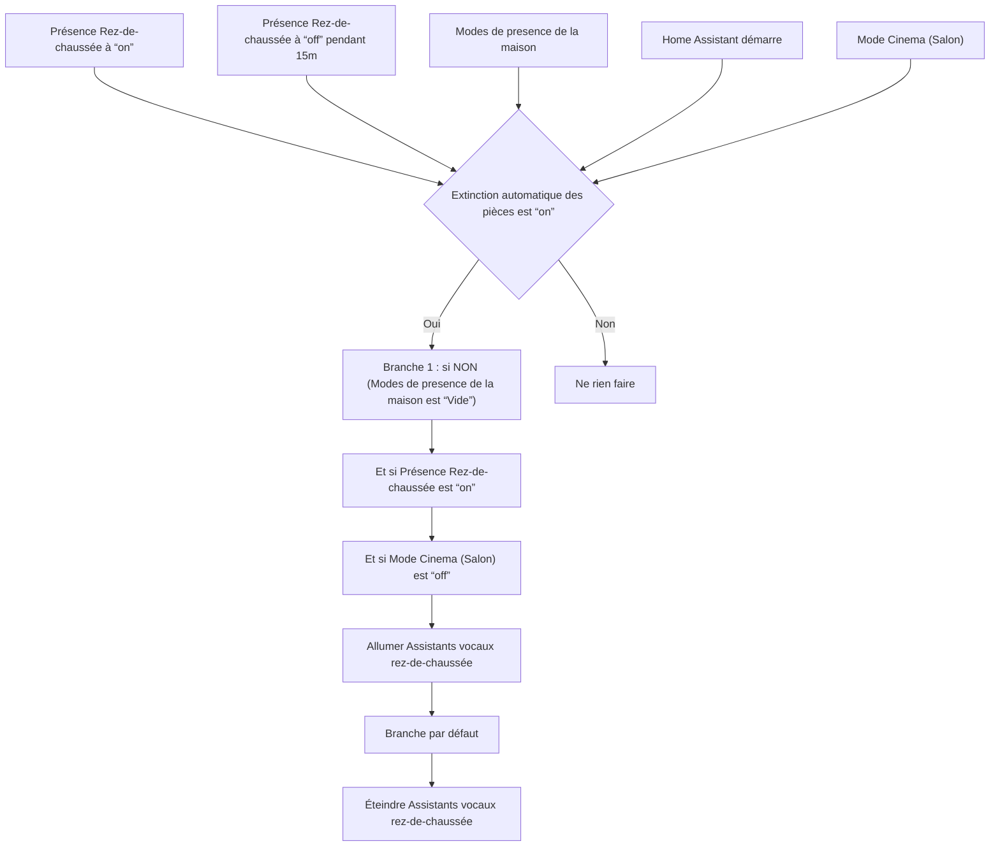

# VPE RdC - Allumer / Éteindre automatiquement / VPE RdC - Allumer / Éteindre automatiquement

## English
- Back to guest-friendly view: [other_background](../../../aspects/other_background.md)
- Back to technical aspect index: [other_background](../other_background.md)

### Summary
- Runs when: Présence Rez-de-chaussée to “on”; Présence Rez-de-chaussée to “off” for 15m; Modes de presence de la maison; Home Assistant starts; Mode Cinema (Salon)
- Only if: Extinction automatique des pièces is “on”
- Then: Branch 1: if NOT (Modes de presence de la maison is “Vide”); And if Présence Rez-de-chaussée is “on”; And if Mode Cinema (Salon) is “off”; Turn on Assistants vocaux rez-de-chaussée; Default branch; Turn off Assistants vocaux rez-de-chaussée

## Français
- Retour vers la vue “invité” : [other_background](../../../aspects/other_background.md)
- Retour vers l’index technique de l’aspect : [other_background](../other_background.md)

### Résumé
- Se déclenche quand : Présence Rez-de-chaussée à “on”; Présence Rez-de-chaussée à “off” pendant 15m; Modes de presence de la maison; Home Assistant démarre; Mode Cinema (Salon)
- Uniquement si : Extinction automatique des pièces est “on”
- Ensuite : Branche 1 : si NON (Modes de presence de la maison est “Vide”); Et si Présence Rez-de-chaussée est “on”; Et si Mode Cinema (Salon) est “off”; Allumer Assistants vocaux rez-de-chaussée; Branche par défaut; Éteindre Assistants vocaux rez-de-chaussée

