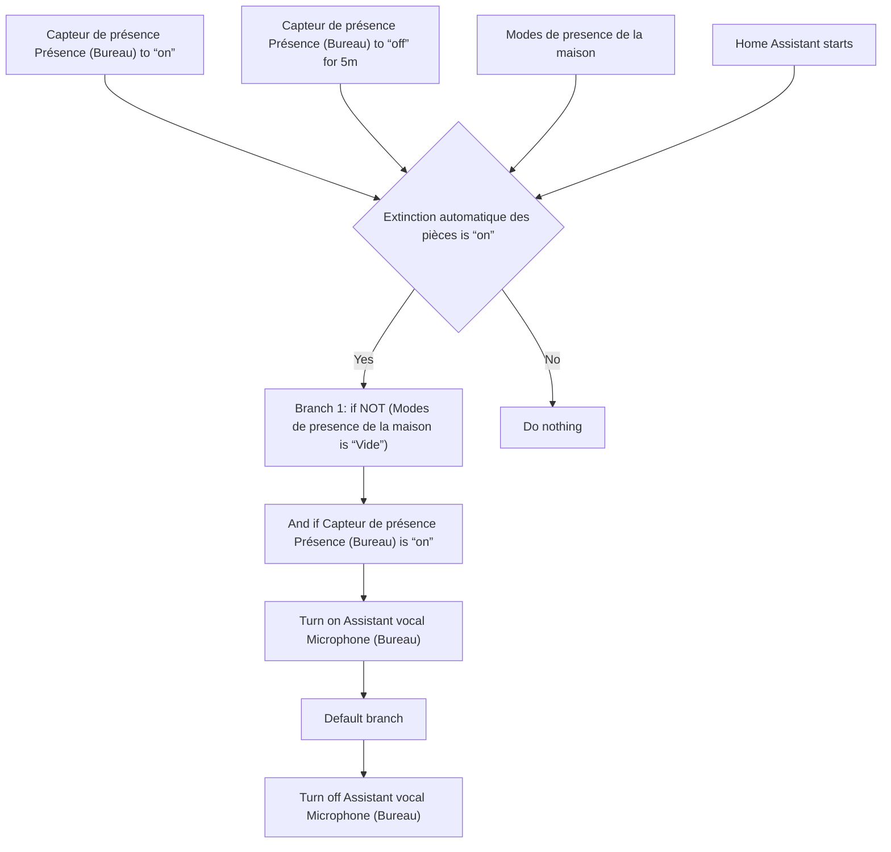
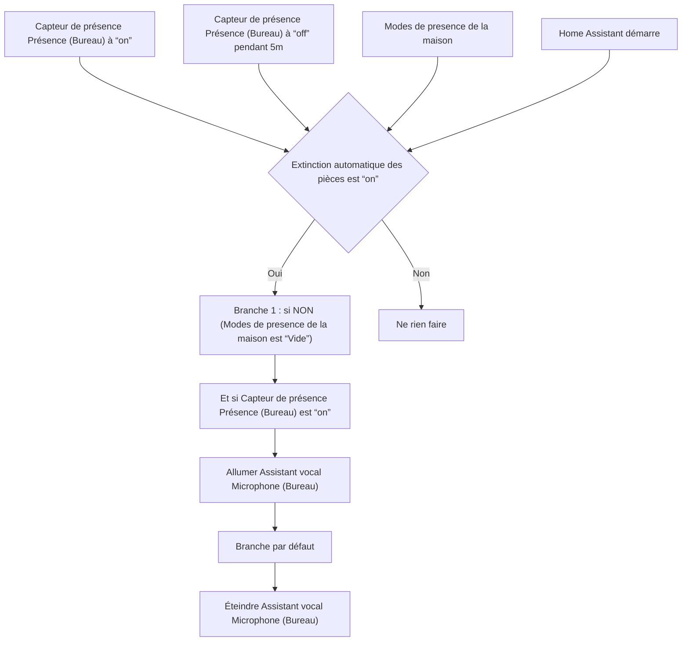

# VPE Bureau - Allumer / Éteindre automatiquement / VPE Bureau - Allumer / Éteindre automatiquement

## English
- Back to guest-friendly view: [other_background](../../../aspects/other_background.md)
- Back to technical aspect index: [other_background](../other_background.md)

### Summary
- Runs when: Capteur de présence Présence (Bureau) to “on”; Capteur de présence Présence (Bureau) to “off” for 5m; Modes de presence de la maison; Home Assistant starts
- Only if: Extinction automatique des pièces is “on”
- Then: Branch 1: if NOT (Modes de presence de la maison is “Vide”); And if Capteur de présence Présence (Bureau) is “on”; Turn on Assistant vocal Microphone (Bureau); Default branch; Turn off Assistant vocal Microphone (Bureau)

## Français
- Retour vers la vue “invité” : [other_background](../../../aspects/other_background.md)
- Retour vers l’index technique de l’aspect : [other_background](../other_background.md)

### Résumé
- Se déclenche quand : Capteur de présence Présence (Bureau) à “on”; Capteur de présence Présence (Bureau) à “off” pendant 5m; Modes de presence de la maison; Home Assistant démarre
- Uniquement si : Extinction automatique des pièces est “on”
- Ensuite : Branche 1 : si NON (Modes de presence de la maison est “Vide”); Et si Capteur de présence Présence (Bureau) est “on”; Allumer Assistant vocal Microphone (Bureau); Branche par défaut; Éteindre Assistant vocal Microphone (Bureau)

