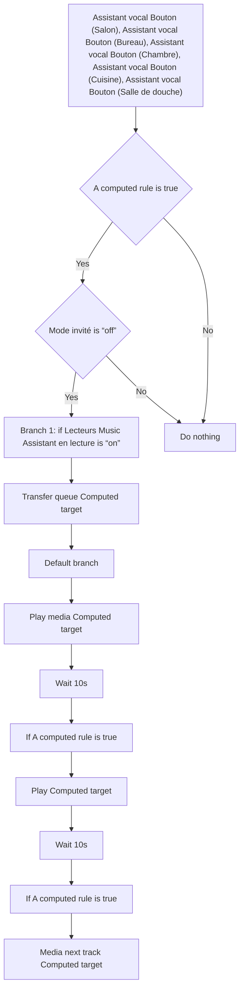
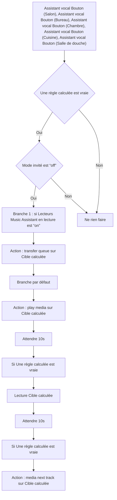

# VPE - Transferer la musique / VPE - Transferer la musique

## English
- Back to guest-friendly view: [other_background](../../../aspects/other_background.md)
- Back to technical aspect index: [other_background](../other_background.md)

### Summary
- Runs when: Assistant vocal Bouton (Salon), Assistant vocal Bouton (Bureau), Assistant vocal Bouton (Chambre), Assistant vocal Bouton (Cuisine), Assistant vocal Bouton (Salle de douche)
- Only if: A computed rule is true; Mode invité is “off”
- Then: Branch 1: if Lecteurs Music Assistant en lecture is “on”; Transfer queue Computed target; Default branch; Play media Computed target; Wait 10s; If A computed rule is true; Play Computed target; Wait 10s; If A computed rule is true; Media next track Computed target

## Français
- Retour vers la vue “invité” : [other_background](../../../aspects/other_background.md)
- Retour vers l’index technique de l’aspect : [other_background](../other_background.md)

### Résumé
- Se déclenche quand : Assistant vocal Bouton (Salon), Assistant vocal Bouton (Bureau), Assistant vocal Bouton (Chambre), Assistant vocal Bouton (Cuisine), Assistant vocal Bouton (Salle de douche)
- Uniquement si : Une règle calculée est vraie; Mode invité est “off”
- Ensuite : Branche 1 : si Lecteurs Music Assistant en lecture est “on”; Action : transfer queue sur Cible calculée; Branche par défaut; Action : play media sur Cible calculée; Attendre 10s; Si Une règle calculée est vraie; Lecture Cible calculée; Attendre 10s; Si Une règle calculée est vraie; Action : media next track sur Cible calculée

