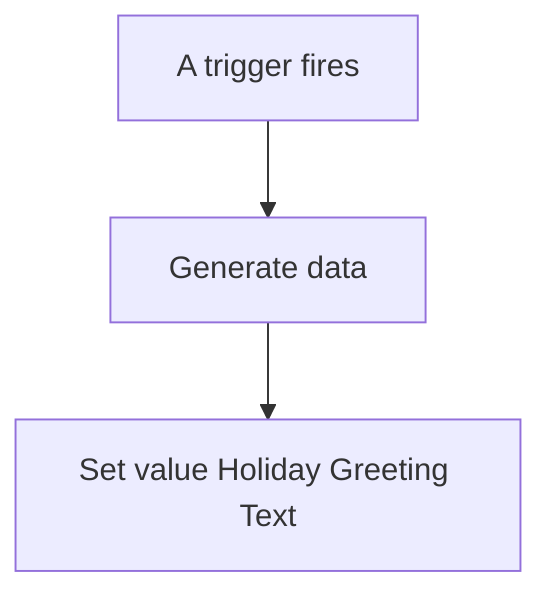
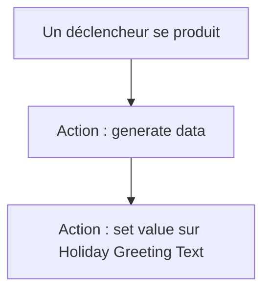

# Dashboard - Générer texte de bonne fête / Dashboard - Générer texte de bonne fête

## English
- Back to guest-friendly view: [other_background](../../../aspects/other_background.md)
- Back to technical aspect index: [other_background](../other_background.md)

### Summary
- Runs when: A trigger fires
- Only if: No extra conditions
- Then: Generate data; Set value Holiday Greeting Text

## Français
- Retour vers la vue “invité” : [other_background](../../../aspects/other_background.md)
- Retour vers l’index technique de l’aspect : [other_background](../other_background.md)

### Résumé
- Se déclenche quand : Un déclencheur se produit
- Uniquement si : Pas de condition supplémentaire
- Ensuite : Action : generate data; Action : set value sur Holiday Greeting Text

