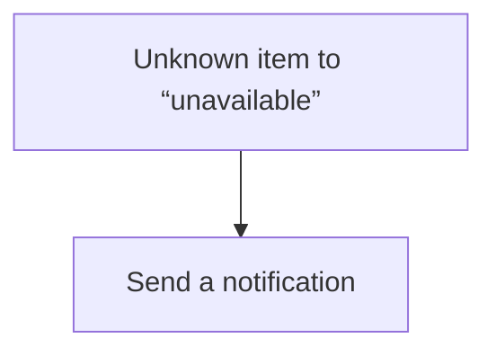
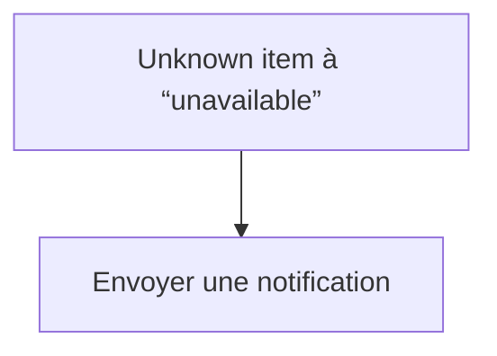

# End of the World / End of the World

## English
- Back to guest-friendly view: [other_background](../../../aspects/other_background.md)
- Back to technical aspect index: [other_background](../other_background.md)

### Summary
- Runs when: Unknown item to “unavailable”
- Only if: No extra conditions
- Then: Send a notification

## Français
- Retour vers la vue “invité” : [other_background](../../../aspects/other_background.md)
- Retour vers l’index technique de l’aspect : [other_background](../other_background.md)

### Résumé
- Se déclenche quand : Unknown item à “unavailable”
- Uniquement si : Pas de condition supplémentaire
- Ensuite : Envoyer une notification

