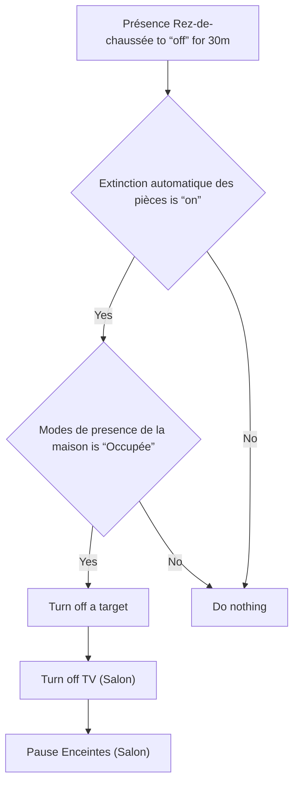
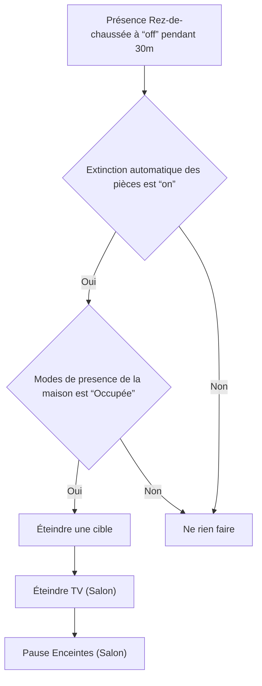

# Éteindre Rez-de-Chaussée si plus de présence / Éteindre Rez-de-Chaussée si plus de présence

## English
- Back to guest-friendly view: [other_background](../../../aspects/other_background.md)
- Back to technical aspect index: [other_background](../other_background.md)

### Summary
- Runs when: Présence Rez-de-chaussée to “off” for 30m
- Only if: Extinction automatique des pièces is “on”; Modes de presence de la maison is “Occupée”
- Then: Turn off a target; Turn off TV (Salon); Pause Enceintes (Salon)

## Français
- Retour vers la vue “invité” : [other_background](../../../aspects/other_background.md)
- Retour vers l’index technique de l’aspect : [other_background](../other_background.md)

### Résumé
- Se déclenche quand : Présence Rez-de-chaussée à “off” pendant 30m
- Uniquement si : Extinction automatique des pièces est “on”; Modes de presence de la maison est “Occupée”
- Ensuite : Éteindre une cible; Éteindre TV (Salon); Pause Enceintes (Salon)

